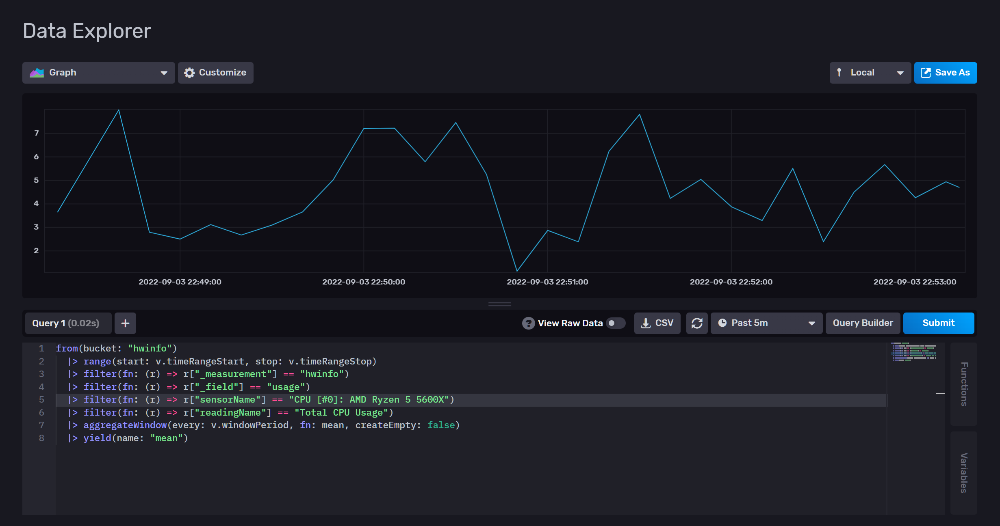

# hwinfo-telegraf-plugin
This [Telegraf](https://www.influxdata.com/time-series-platform/telegraf/) plugin gathers hardware sensor readings (clock speed, temperature, utilization) from a Windows machine running [HWiNFO](https://www.hwinfo.com/).

- [hwinfo-telegraf-plugin](#hwinfo-telegraf-plugin)
  * [Installation](#installation)
    + [Download `.exe`](#download-exe)
    + [Build From Source](#build-from-source)
  * [Usage](#usage)
    + [Limitations](#limitations)
  * [Configuration](#configuration)
  * [Metrics](#metrics)
    + [Types](#types)
    + [Example Output](#example-output)
    + [Example Influx Query](#example-influx-query)
  * [Grafana Dashboard](#grafana-dashboard)
  * [Credits](#credits)
  * [License](#license)
  * [Future Plans](#future-plans)

---

<br />

## Installation
### Download `.exe`
Simply download `hwinfo-telegraf-plugin.exe` from the [latest release](https://github.com/zachstence/hwinfo-telegraf-plugin/releases).

### Build From Source
*These instructions assume you have Go installed and configured on your machine*

Clone the repository
```sh
git clone https://github.com/zachstence/hwinfo-telegraf-plugin
cd hwinfo-telegraf-plugin
```

Build the module into an executable
```sh
go build -o hwinfo-telegraf-plugin.exe cmd/main.go
```

## Usage
Reference the executable and config in your `telegraf.conf` using the `execd` input
```toml
[[inputs.execd]]
  command = ["/path/to/hwinfo-telegraf-plugin.exe"] # no config
```

More documentation on using Telegraf external plugins can be found [here](https://github.com/influxdata/telegraf/blob/master/docs/EXTERNAL_PLUGINS.md).

### Limitations
[Relevant HWiNFO Forum Post](https://www.hwinfo.com/forum/threads/important-changes-to-hwinfo64-coming-soon.7092/)
> Shared Memory Interface (SHM) in HWiNFO64 (non-Pro) will be run-time limited to 12 hours. HWiNFO64 Pro will not have such limit.

Regardless of the installation method used, access to the HWiNFO Shared Memory Interface (where this plugin gets data from) is limited to 12 hours at a time. After running HWiNFO for 12 hours continuously, Shared Memory access will need to be re-enabled manually.

The [Pro version](https://www.hwinfo.com/licenses/) of HWiNFO does not have this limitation, so it (and this plugin) can be run indefinitely without interruption. I encourage you to purchase a Pro license to support the amazing work done by [@malikm](https://github.com/malikm).

## Configuration
At this time, no configuration options are available. If you have a need for one, feel free to open up an issue or PR!

```toml @sample.conf
[[inputs.hwinfo]]
  # no config
```

## Metrics
Each measurement includes one of the available fields. The sensors that are reported depend on the hardware and its available sensors.

Possible values for `_field` are dictated by the `Reading.ReadingType().String()` function defined [here](https://github.com/zachstence/hwinfo-telegraf-plugin/blob/6234ce0cd78a46c291b40f963a48c13296580d5c/plugins/inputs/hwinfo/internal/reading.go#L39).

### Types
- hwinfo
  - tags:
    - sensorId
    - sensorInst
    - sensorNameOrig
    - sensorName
    - sensorType
    - readingId
    - readingNameOrig
    - readingName
    - unit
  - fields:
    - none
    - temp
    - volt
    - fan
    - current
    - power
    - clock
    - usage
    - other

### Example Output
```txt
hwinfo,readingId=134217728,readingName=Virtual\ Memory\ Committed,readingNameOrig=Virtual\ Memory\ Committed,sensorId=402653260900,sensorInst=0,sensorName=System:\ MSI\ MS-7C92,sensorNameOrig=System:\ MSI\ MS-7C92,sensorType=system,unit=MB other=19279 1662305471008264800
hwinfo,readingId=134217729,readingName=Virtual\ Memory\ Available,readingNameOrig=Virtual\ Memory\ Available,sensorId=402653260900,sensorInst=0,sensorName=System:\ MSI\ MS-7C92,sensorNameOrig=System:\ MSI\ MS-7C92,sensorType=system,unit=MB other=32870 1662305471008264800
hwinfo,readingId=134217730,readingName=Virtual\ Memory\ Load,readingNameOrig=Virtual\ Memory\ Load,sensorId=402653260900,sensorInst=0,sensorName=System:\ MSI\ MS-7C92,sensorNameOrig=System:\ MSI\ MS-7C92,sensorType=system,unit=% other=36.9 1662305471008264800
hwinfo,readingId=134217731,readingName=Physical\ Memory\ Used,readingNameOrig=Physical\ Memory\ Used,sensorId=402653260900,sensorInst=0,sensorName=System:\ MSI\ MS-7C92,sensorNameOrig=System:\ MSI\ MS-7C92,sensorType=system,unit=MB other=15791 1662305471008783900       
hwinfo,readingId=134217732,readingName=Physical\ Memory\ Available,readingNameOrig=Physical\ Memory\ Available,sensorId=402653260900,sensorInst=0,sensorName=System:\ MSI\ MS-7C92,sensorNameOrig=System:\ MSI\ MS-7C92,sensorType=system,unit=MB other=16902 1662305471009305700
hwinfo,readingId=134217733,readingName=Physical\ Memory\ Load,readingNameOrig=Physical\ Memory\ Load,sensorId=402653260900,sensorInst=0,sensorName=System:\ MSI\ MS-7C92,sensorNameOrig=System:\ MSI\ MS-7C92,sensorType=system,unit=% other=48.3 1662305471009829800
hwinfo,readingId=134217734,readingName=Page\ File\ Usage,readingNameOrig=Page\ File\ Usage,sensorId=402653260900,sensorInst=0,sensorName=System:\ MSI\ MS-7C92,sensorNameOrig=System:\ MSI\ MS-7C92,sensorType=system,unit=% other=0 1662305471009829800
hwinfo,readingId=33554432,readingName=Core\ 0\ VID,readingNameOrig=Core\ 0\ VID,sensorId=402653260800,sensorInst=0,sensorName=CPU\ [#0]:\ AMD\ Ryzen\ 5\ 5600X,sensorNameOrig=CPU\ [#0]:\ AMD\ Ryzen\ 5\ 5600X,sensorType=cpu,unit=V volt=1.31875 1662305471010346200
hwinfo,readingId=33554433,readingName=Core\ 1\ VID,readingNameOrig=Core\ 1\ VID,sensorId=402653260800,sensorInst=0,sensorName=CPU\ [#0]:\ AMD\ Ryzen\ 5\ 5600X,sensorNameOrig=CPU\ [#0]:\ AMD\ Ryzen\ 5\ 5600X,sensorType=cpu,unit=V volt=1.3375 1662305471010346200
hwinfo,readingId=33554434,readingName=Core\ 2\ VID,readingNameOrig=Core\ 2\ VID,sensorId=402653260800,sensorInst=0,sensorName=CPU\ [#0]:\ AMD\ Ryzen\ 5\ 5600X,sensorNameOrig=CPU\ [#0]:\ AMD\ Ryzen\ 5\ 5600X,sensorType=cpu,unit=V volt=1.3375 1662305471010346200
hwinfo,readingId=33554435,readingName=Core\ 3\ VID,readingNameOrig=Core\ 3\ VID,sensorId=402653260800,sensorInst=0,sensorName=CPU\ [#0]:\ AMD\ Ryzen\ 5\ 5600X,sensorNameOrig=CPU\ [#0]:\ AMD\ Ryzen\ 5\ 5600X,sensorType=cpu,unit=V volt=1.3375 1662305471010867300
hwinfo,readingId=33554436,readingName=Core\ 4\ VID,readingNameOrig=Core\ 4\ VID,sensorId=402653260800,sensorInst=0,sensorName=CPU\ [#0]:\ AMD\ Ryzen\ 5\ 5600X,sensorNameOrig=CPU\ [#0]:\ AMD\ Ryzen\ 5\ 5600X,sensorType=cpu,unit=V volt=1.3375 1662305471010867300
hwinfo,readingId=33554437,readingName=Core\ 5\ VID,readingNameOrig=Core\ 5\ VID,sensorId=402653260800,sensorInst=0,sensorName=CPU\ [#0]:\ AMD\ Ryzen\ 5\ 5600X,sensorNameOrig=CPU\ [#0]:\ AMD\ Ryzen\ 5\ 5600X,sensorType=cpu,unit=V volt=1.31875 1662305471011916500
hwinfo,readingId=100663296,readingName=Core\ 0\ Clock\ (perf\ #1/1),readingNameOrig=Core\ 
0\ Clock\ (perf\ #1/1),sensorId=402653260800,sensorInst=0,sensorName=CPU\ [#0]:\ AMD\ Ryzen\ 5\ 5600X,sensorNameOrig=CPU\ [#0]:\ AMD\ Ryzen\ 5\ 5600X,sensorType=cpu,unit=MHz clock=4525.394279726201 1662305471011916500
hwinfo,readingId=100663297,readingName=Core\ 1\ Clock\ (perf\ #5/6),readingNameOrig=Core\ 
1\ Clock\ (perf\ #5/6),sensorId=402653260800,sensorInst=0,sensorName=CPU\ [#0]:\ AMD\ Ryzen\ 5\ 5600X,sensorNameOrig=CPU\ [#0]:\ AMD\ Ryzen\ 5\ 5600X,sensorType=cpu,unit=MHz clock=4500.665349235894 1662305471012430600
hwinfo,readingId=100663298,readingName=Core\ 2\ Clock\ (perf\ #2/3),readingNameOrig=Core\ 
2\ Clock\ (perf\ #2/3),sensorId=402653260800,sensorInst=0,sensorName=CPU\ [#0]:\ AMD\ Ryzen\ 5\ 5600X,sensorNameOrig=CPU\ [#0]:\ AMD\ Ryzen\ 5\ 5600X,sensorType=cpu,unit=MHz clock=4500.665349235894 1662305471012439200
hwinfo,readingId=100663299,readingName=Core\ 3\ Clock\ (perf\ #3/4),readingNameOrig=Core\ 
3\ Clock\ (perf\ #3/4),sensorId=402653260800,sensorInst=0,sensorName=CPU\ [#0]:\ AMD\ Ryzen\ 5\ 5600X,sensorNameOrig=CPU\ [#0]:\ AMD\ Ryzen\ 5\ 5600X,sensorType=cpu,unit=MHz clock=4500.665349235894 1662305471012960100
hwinfo,readingId=100663300,readingName=Core\ 4\ Clock\ (perf\ #1/2),readingNameOrig=Core\ 
4\ Clock\ (perf\ #1/2),sensorId=402653260800,sensorInst=0,sensorName=CPU\ [#0]:\ AMD\ Ryzen\ 5\ 5600X,sensorNameOrig=CPU\ [#0]:\ AMD\ Ryzen\ 5\ 5600X,sensorType=cpu,unit=MHz clock=4500.665349235894 1662305471012960100
hwinfo,readingId=100663301,readingName=Core\ 5\ Clock\ (perf\ #4/5),readingNameOrig=Core\ 
5\ Clock\ (perf\ #4/5),sensorId=402653260800,sensorInst=0,sensorName=CPU\ [#0]:\ AMD\ Ryzen\ 5\ 5600X,sensorNameOrig=CPU\ [#0]:\ AMD\ Ryzen\ 5\ 5600X,sensorType=cpu,unit=MHz clock=4500.665349235894 1662305471013483300
hwinfo,readingId=100663302,readingName=Bus\ Clock,readingNameOrig=Bus\ Clock,sensorId=402653260800,sensorInst=0,sensorName=CPU\ [#0]:\ AMD\ Ryzen\ 5\ 5600X,sensorNameOrig=CPU\ [#0]:\ AMD\ Ryzen\ 5\ 5600X,sensorType=cpu,unit=MHz clock=98.91572196122843 1662305471013483300
hwinfo,readingId=100663312,readingName=Core\ 0\ T0\ Effective\ Clock,readingNameOrig=Core\ 0\ T0\ Effective\ Clock,sensorId=402653260800,sensorInst=0,sensorName=CPU\ [#0]:\ AMD\ Ryzen\ 5\ 5600X,sensorNameOrig=CPU\ [#0]:\ AMD\ Ryzen\ 5\ 5600X,sensorType=cpu,unit=MHz clock=4242.77490234375 1662305471014006100
hwinfo,readingId=100663313,readingName=Core\ 0\ T1\ Effective\ Clock,readingNameOrig=Core\ 0\ T1\ Effective\ Clock,sensorId=402653260800,sensorInst=0,sensorName=CPU\ [#0]:\ AMD\ Ryzen\ 5\ 5600X,sensorNameOrig=CPU\ [#0]:\ AMD\ Ryzen\ 5\ 5600X,sensorType=cpu,unit=MHz clock=3863.7901530061376 1662305471014641900
hwinfo,readingId=100663314,readingName=Core\ 1\ T0\ Effective\ Clock,readingNameOrig=Core\ 1\ T0\ Effective\ Clock,sensorId=402653260800,sensorInst=0,sensorName=CPU\ [#0]:\ AMD\ Ryzen\ 5\ 5600X,sensorNameOrig=CPU\ [#0]:\ AMD\ Ryzen\ 5\ 5600X,sensorType=cpu,unit=MHz clock=3994.020441768201 1662305471014641900
hwinfo,readingId=100663315,readingName=Core\ 1\ T1\ Effective\ Clock,readingNameOrig=Core\ 1\ T1\ Effective\ Clock,sensorId=402653260800,sensorInst=0,sensorName=CPU\ [#0]:\ AMD\ Ryzen\ 5\ 5600X,sensorNameOrig=CPU\ [#0]:\ AMD\ Ryzen\ 5\ 5600X,sensorType=cpu,unit=MHz clock=3930.747959809913 1662305471015155500
hwinfo,readingId=100663316,readingName=Core\ 2\ T0\ Effective\ Clock,readingNameOrig=Core\ 2\ T0\ Effective\ Clock,sensorId=402653260800,sensorInst=0,sensorName=CPU\ [#0]:\ AMD\ Ryzen\ 5\ 5600X,sensorNameOrig=CPU\ [#0]:\ AMD\ Ryzen\ 5\ 5600X,sensorType=cpu,unit=MHz clock=3738.636463728255 1662305471015155500
hwinfo,readingId=100663317,readingName=Core\ 2\ T1\ Effective\ Clock,readingNameOrig=Core\ 2\ T1\ Effective\ Clock,sensorId=402653260800,sensorInst=0,sensorName=CPU\ [#0]:\ AMD\ Ryzen\ 5\ 5600X,sensorNameOrig=CPU\ [#0]:\ AMD\ Ryzen\ 5\ 5600X,sensorType=cpu,unit=MHz clock=3544.8540033996233 1662305471015679700
hwinfo,readingId=100663318,readingName=Core\ 3\ T0\ Effective\ Clock,readingNameOrig=Core\ 3\ T0\ Effective\ Clock,sensorId=402653260800,sensorInst=0,sensorName=CPU\ [#0]:\ AMD\ Ryzen\ 5\ 5600X,sensorNameOrig=CPU\ [#0]:\ AMD\ Ryzen\ 5\ 5600X,sensorType=cpu,unit=MHz clock=3755.7689932820876 1662305471015679700
hwinfo,readingId=100663319,readingName=Core\ 3\ T1\ Effective\ Clock,readingNameOrig=Core\ 3\ T1\ Effective\ Clock,sensorId=402653260800,sensorInst=0,sensorName=CPU\ [#0]:\ AMD\ Ryzen\ 5\ 5600X,sensorNameOrig=CPU\ [#0]:\ AMD\ Ryzen\ 5\ 5600X,sensorType=cpu,unit=MHz clock=3655.7037302171893 1662305471015679700
hwinfo,readingId=100663320,readingName=Core\ 4\ T0\ Effective\ Clock,readingNameOrig=Core\ 4\ T0\ Effective\ Clock,sensorId=402653260800,sensorInst=0,sensorName=CPU\ [#0]:\ AMD\ Ryzen\ 5\ 5600X,sensorNameOrig=CPU\ [#0]:\ AMD\ Ryzen\ 5\ 5600X,sensorType=cpu,unit=MHz clock=3753.5244392109685 1662305471016200400
hwinfo,readingId=100663321,readingName=Core\ 4\ T1\ Effective\ Clock,readingNameOrig=Core\ 4\ T1\ Effective\ Clock,sensorId=402653260800,sensorInst=0,sensorName=CPU\ [#0]:\ AMD\ Ryzen\ 5\ 5600X,sensorNameOrig=CPU\ [#0]:\ AMD\ Ryzen\ 5\ 5600X,sensorType=cpu,unit=MHz clock=3850.1539144984918 1662305471016726000
hwinfo,readingId=100663322,readingName=Core\ 5\ T0\ Effective\ Clock,readingNameOrig=Core\ 5\ T0\ Effective\ Clock,sensorId=402653260800,sensorInst=0,sensorName=CPU\ [#0]:\ AMD\ Ryzen\ 5\ 5600X,sensorNameOrig=CPU\ [#0]:\ AMD\ Ryzen\ 5\ 5600X,sensorType=cpu,unit=MHz clock=3780.1709509210123 1662305471016726000
hwinfo,readingId=100663323,readingName=Core\ 5\ T1\ Effective\ Clock,readingNameOrig=Core\ 5\ T1\ Effective\ Clock,sensorId=402653260800,sensorInst=0,sensorName=CPU\ [#0]:\ AMD\ Ryzen\ 5\ 5600X,sensorNameOrig=CPU\ [#0]:\ AMD\ Ryzen\ 5\ 5600X,sensorType=cpu,unit=MHz clock=3649.163273140934 1662305471017248700
hwinfo,readingId=100663324,readingName=Average\ Effective\ Clock,readingNameOrig=Average\ 
Effective\ Clock,sensorId=402653260800,sensorInst=0,sensorName=CPU\ [#0]:\ AMD\ Ryzen\ 5\ 
5600X,sensorNameOrig=CPU\ [#0]:\ AMD\ Ryzen\ 5\ 5600X,sensorType=cpu,unit=MHz clock=3813.2757687772137 1662305471017764400
hwinfo,readingId=117440512,readingName=Core\ 0\ T0\ Usage,readingNameOrig=Core\ 0\ T0\ Usage,sensorId=402653260800,sensorInst=0,sensorName=CPU\ [#0]:\ AMD\ Ryzen\ 5\ 5600X,sensorNameOrig=CPU\ [#0]:\ AMD\ Ryzen\ 5\ 5600X,sensorType=cpu,unit=% usage=86.7 1662305471017764400
hwinfo,readingId=117440513,readingName=Core\ 0\ T1\ Usage,readingNameOrig=Core\ 0\ T1\ Usage,sensorId=402653260800,sensorInst=0,sensorName=CPU\ [#0]:\ AMD\ Ryzen\ 5\ 5600X,sensorNameOrig=CPU\ [#0]:\ AMD\ Ryzen\ 5\ 5600X,sensorType=cpu,unit=% usage=85.2 1662305471019257600
hwinfo,readingId=117440514,readingName=Core\ 1\ T0\ Usage,readingNameOrig=Core\ 1\ T0\ Usage,sensorId=402653260800,sensorInst=0,sensorName=CPU\ [#0]:\ AMD\ Ryzen\ 5\ 5600X,sensorNameOrig=CPU\ [#0]:\ AMD\ Ryzen\ 5\ 5600X,sensorType=cpu,unit=% usage=94.1 1662305471019257600
hwinfo,readingId=117440515,readingName=Core\ 1\ T1\ Usage,readingNameOrig=Core\ 1\ T1\ Usage,sensorId=402653260800,sensorInst=0,sensorName=CPU\ [#0]:\ AMD\ Ryzen\ 5\ 5600X,sensorNameOrig=CPU\ [#0]:\ AMD\ Ryzen\ 5\ 5600X,sensorType=cpu,unit=% usage=86.7 1662305471019781700
hwinfo,readingId=117440516,readingName=Core\ 2\ T0\ Usage,readingNameOrig=Core\ 2\ T0\ Usage,sensorId=402653260800,sensorInst=0,sensorName=CPU\ [#0]:\ AMD\ Ryzen\ 5\ 5600X,sensorNameOrig=CPU\ [#0]:\ AMD\ Ryzen\ 5\ 5600X,sensorType=cpu,unit=% usage=87.5 1662305471019781700
hwinfo,readingId=117440517,readingName=Core\ 2\ T1\ Usage,readingNameOrig=Core\ 2\ T1\ Usage,sensorId=402653260800,sensorInst=0,sensorName=CPU\ [#0]:\ AMD\ Ryzen\ 5\ 5600X,sensorNameOrig=CPU\ [#0]:\ AMD\ Ryzen\ 5\ 5600X,sensorType=cpu,unit=% usage=77.9 1662305471020294600
hwinfo,readingId=117440518,readingName=Core\ 3\ T0\ Usage,readingNameOrig=Core\ 3\ T0\ Usage,sensorId=402653260800,sensorInst=0,sensorName=CPU\ [#0]:\ AMD\ Ryzen\ 5\ 5600X,sensorNameOrig=CPU\ [#0]:\ AMD\ Ryzen\ 5\ 5600X,sensorType=cpu,unit=% usage=82.3 1662305471020294600
hwinfo,readingId=117440519,readingName=Core\ 3\ T1\ Usage,readingNameOrig=Core\ 3\ T1\ Usage,sensorId=402653260800,sensorInst=0,sensorName=CPU\ [#0]:\ AMD\ Ryzen\ 5\ 5600X,sensorNameOrig=CPU\ [#0]:\ AMD\ Ryzen\ 5\ 5600X,sensorType=cpu,unit=% usage=89.7 1662305471020824400
hwinfo,readingId=117440520,readingName=Core\ 4\ T0\ Usage,readingNameOrig=Core\ 4\ T0\ Usage,sensorId=402653260800,sensorInst=0,sensorName=CPU\ [#0]:\ AMD\ Ryzen\ 5\ 5600X,sensorNameOrig=CPU\ [#0]:\ AMD\ Ryzen\ 5\ 5600X,sensorType=cpu,unit=% usage=83.8 1662305471020824400
hwinfo,readingId=117440521,readingName=Core\ 4\ T1\ Usage,readingNameOrig=Core\ 4\ T1\ Usage,sensorId=402653260800,sensorInst=0,sensorName=CPU\ [#0]:\ AMD\ Ryzen\ 5\ 5600X,sensorNameOrig=CPU\ [#0]:\ AMD\ Ryzen\ 5\ 5600X,sensorType=cpu,unit=% usage=88.9 1662305471021349700
hwinfo,readingId=117440522,readingName=Core\ 5\ T0\ Usage,readingNameOrig=Core\ 5\ T0\ Usage,sensorId=402653260800,sensorInst=0,sensorName=CPU\ [#0]:\ AMD\ Ryzen\ 5\ 5600X,sensorNameOrig=CPU\ [#0]:\ AMD\ Ryzen\ 5\ 5600X,sensorType=cpu,unit=% usage=85.2 1662305471021349700
hwinfo,readingId=117440523,readingName=Core\ 5\ T1\ Usage,readingNameOrig=Core\ 5\ T1\ Usage,sensorId=402653260800,sensorInst=0,sensorName=CPU\ [#0]:\ AMD\ Ryzen\ 5\ 5600X,sensorNameOrig=CPU\ [#0]:\ AMD\ Ryzen\ 5\ 5600X,sensorType=cpu,unit=% usage=80.1 1662305471021876300
hwinfo,readingId=117440524,readingName=Max\ CPU/Thread\ Usage,readingNameOrig=Max\ CPU/Thread\ Usage,sensorId=402653260800,sensorInst=0,sensorName=CPU\ [#0]:\ AMD\ Ryzen\ 5\ 5600X,sensorNameOrig=CPU\ [#0]:\ AMD\ Ryzen\ 5\ 5600X,sensorType=cpu,unit=% usage=94.1 1662305471022392200
hwinfo,readingId=117440525,readingName=Total\ CPU\ Usage,readingNameOrig=Total\ CPU\ Usage,sensorId=402653260800,sensorInst=0,sensorName=CPU\ [#0]:\ AMD\ Ryzen\ 5\ 5600X,sensorNameOrig=CPU\ [#0]:\ AMD\ Ryzen\ 5\ 5600X,sensorType=cpu,unit=% usage=85.675 1662305471022437400
hwinfo,readingId=117440527,readingName=Core\ 0\ T0\ Utility,readingNameOrig=Core\ 0\ T0\ Utility,sensorId=402653260800,sensorInst=0,sensorName=CPU\ [#0]:\ AMD\ Ryzen\ 5\ 5600X,sensorNameOrig=CPU\ [#0]:\ AMD\ Ryzen\ 5\ 5600X,sensorType=cpu,unit=% usage=103.41296217581794 1662305471022437400
hwinfo,readingId=117440528,readingName=Core\ 0\ T1\ Utility,readingNameOrig=Core\ 0\ T1\ Utility,sensorId=402653260800,sensorInst=0,sensorName=CPU\ [#0]:\ AMD\ Ryzen\ 5\ 5600X,sensorNameOrig=CPU\ [#0]:\ AMD\ Ryzen\ 5\ 5600X,sensorType=cpu,unit=% usage=103.91584258052113 1662305471022960200
hwinfo,readingId=117440529,readingName=Core\ 1\ T0\ Utility,readingNameOrig=Core\ 1\ T0\ Utility,sensorId=402653260800,sensorInst=0,sensorName=CPU\ [#0]:\ AMD\ Ryzen\ 5\ 5600X,sensorNameOrig=CPU\ [#0]:\ AMD\ Ryzen\ 5\ 5600X,sensorType=cpu,unit=% usage=107.35686016227436 1662305471022960200
hwinfo,readingId=117440530,readingName=Core\ 1\ T1\ Utility,readingNameOrig=Core\ 1\ T1\ Utility,sensorId=402653260800,sensorInst=0,sensorName=CPU\ [#0]:\ AMD\ Ryzen\ 5\ 5600X,sensorNameOrig=CPU\ [#0]:\ AMD\ Ryzen\ 5\ 5600X,sensorType=cpu,unit=% usage=105.6544107265698 
1662305471023569100
hwinfo,readingId=117440531,readingName=Core\ 2\ T0\ Utility,readingNameOrig=Core\ 2\ T0\ Utility,sensorId=402653260800,sensorInst=0,sensorName=CPU\ [#0]:\ AMD\ Ryzen\ 5\ 5600X,sensorNameOrig=CPU\ [#0]:\ AMD\ Ryzen\ 5\ 5600X,sensorType=cpu,unit=% usage=100.53049006244532 1662305471024086300
hwinfo,readingId=117440532,readingName=Core\ 2\ T1\ Utility,readingNameOrig=Core\ 2\ T1\ Utility,sensorId=402653260800,sensorInst=0,sensorName=CPU\ [#0]:\ AMD\ Ryzen\ 5\ 5600X,sensorNameOrig=CPU\ [#0]:\ AMD\ Ryzen\ 5\ 5600X,sensorType=cpu,unit=% usage=95.1743297162808 1662305471024086300
hwinfo,readingId=117440533,readingName=Core\ 3\ T0\ Utility,readingNameOrig=Core\ 3\ T0\ Utility,sensorId=402653260800,sensorInst=0,sensorName=CPU\ [#0]:\ AMD\ Ryzen\ 5\ 5600X,sensorNameOrig=CPU\ [#0]:\ AMD\ Ryzen\ 5\ 5600X,sensorType=cpu,unit=% usage=100.96273604920563 1662305471024607600
hwinfo,readingId=117440534,readingName=Core\ 3\ T1\ Utility,readingNameOrig=Core\ 3\ T1\ Utility,sensorId=402653260800,sensorInst=0,sensorName=CPU\ [#0]:\ AMD\ Ryzen\ 5\ 5600X,sensorNameOrig=CPU\ [#0]:\ AMD\ Ryzen\ 5\ 5600X,sensorType=cpu,unit=% usage=98.26851298334574 
1662305471024607600
hwinfo,readingId=117440535,readingName=Core\ 4\ T0\ Utility,readingNameOrig=Core\ 4\ T0\ Utility,sensorId=402653260800,sensorInst=0,sensorName=CPU\ [#0]:\ AMD\ Ryzen\ 5\ 5600X,sensorNameOrig=CPU\ [#0]:\ AMD\ Ryzen\ 5\ 5600X,sensorType=cpu,unit=% usage=100.95032169348885 1662305471025133200
hwinfo,readingId=117440536,readingName=Core\ 4\ T1\ Utility,readingNameOrig=Core\ 4\ T1\ Utility,sensorId=402653260800,sensorInst=0,sensorName=CPU\ [#0]:\ AMD\ Ryzen\ 5\ 5600X,sensorNameOrig=CPU\ [#0]:\ AMD\ Ryzen\ 5\ 5600X,sensorType=cpu,unit=% usage=103.54244089201575 1662305471025651000
hwinfo,readingId=117440537,readingName=Core\ 5\ T0\ Utility,readingNameOrig=Core\ 5\ T0\ Utility,sensorId=402653260800,sensorInst=0,sensorName=CPU\ [#0]:\ AMD\ Ryzen\ 5\ 5600X,sensorNameOrig=CPU\ [#0]:\ AMD\ Ryzen\ 5\ 5600X,sensorType=cpu,unit=% usage=101.67617486962583 1662305471025651000
hwinfo,readingId=117440538,readingName=Core\ 5\ T1\ Utility,readingNameOrig=Core\ 5\ T1\ Utility,sensorId=402653260800,sensorInst=0,sensorName=CPU\ [#0]:\ AMD\ Ryzen\ 5\ 5600X,sensorNameOrig=CPU\ [#0]:\ AMD\ Ryzen\ 5\ 5600X,sensorType=cpu,unit=% usage=98.18551623659467 
1662305471026175500
hwinfo,readingId=117440539,readingName=Total\ CPU\ Utility,readingNameOrig=Total\ CPU\ Utility,sensorId=402653260800,sensorInst=0,sensorName=CPU\ [#0]:\ AMD\ Ryzen\ 5\ 5600X,sensorNameOrig=CPU\ [#0]:\ AMD\ Ryzen\ 5\ 5600X,sensorType=cpu,unit=% usage=101.64258496882711 1662305471026175500
hwinfo,readingId=134217728,readingName=Core\ 0\ Ratio,readingNameOrig=Core\ 0\ Ratio,sensorId=402653260800,sensorInst=0,sensorName=CPU\ [#0]:\ AMD\ Ryzen\ 5\ 5600X,sensorNameOrig=CPU\ [#0]:\ AMD\ Ryzen\ 5\ 5600X,sensorType=cpu,unit=x other=45.75 1662305471026698600     
hwinfo,readingId=134217729,readingName=Core\ 1\ Ratio,readingNameOrig=Core\ 1\ Ratio,sensorId=402653260800,sensorInst=0,sensorName=CPU\ [#0]:\ AMD\ Ryzen\ 5\ 5600X,sensorNameOrig=CPU\ [#0]:\ AMD\ Ryzen\ 5\ 5600X,sensorType=cpu,unit=x other=45.5 1662305471026698600      
hwinfo,readingId=134217730,readingName=Core\ 2\ Ratio,readingNameOrig=Core\ 2\ Ratio,sensorId=402653260800,sensorInst=0,sensorName=CPU\ [#0]:\ AMD\ Ryzen\ 5\ 5600X,sensorNameOrig=CPU\ [#0]:\ AMD\ Ryzen\ 5\ 5600X,sensorType=cpu,unit=x other=45.5 1662305471027228400      
hwinfo,readingId=134217731,readingName=Core\ 3\ Ratio,readingNameOrig=Core\ 3\ Ratio,sensorId=402653260800,sensorInst=0,sensorName=CPU\ [#0]:\ AMD\ Ryzen\ 5\ 5600X,sensorNameOrig=CPU\ [#0]:\ AMD\ Ryzen\ 5\ 5600X,sensorType=cpu,unit=x other=45.5 1662305471027228400      
hwinfo,readingId=134217732,readingName=Core\ 4\ Ratio,readingNameOrig=Core\ 4\ Ratio,sensorId=402653260800,sensorInst=0,sensorName=CPU\ [#0]:\ AMD\ Ryzen\ 5\ 5600X,sensorNameOrig=CPU\ [#0]:\ AMD\ Ryzen\ 5\ 5600X,sensorType=cpu,unit=x other=45.5 1662305471027749600      
hwinfo,readingId=134217733,readingName=Core\ 5\ Ratio,readingNameOrig=Core\ 5\ Ratio,sensorId=402653260800,sensorInst=0,sensorName=CPU\ [#0]:\ AMD\ Ryzen\ 5\ 5600X,sensorNameOrig=CPU\ [#0]:\ AMD\ Ryzen\ 5\ 5600X,sensorType=cpu,unit=x other=45.5 1662305471028450600      
hwinfo,readingId=117440524,readingName=Core\ 0\ C0\ Residency,readingNameOrig=Core\ 0\ C0\ Residency,sensorId=402653261000,sensorInst=0,sensorName=CPU\ [#0]:\ AMD\ Ryzen\ 5\ 5600X:\ C-State\ Residency,sensorNameOrig=CPU\ [#0]:\ AMD\ Ryzen\ 5\ 5600X:\ C-State\ Residency,sensorType=cpu,unit=% usage=97.20550537109375 1662305471029498600
hwinfo,readingId=117440526,readingName=Core\ 1\ C0\ Residency,readingNameOrig=Core\ 1\ C0\ Residency,sensorId=402653261000,sensorInst=0,sensorName=CPU\ [#0]:\ AMD\ Ryzen\ 5\ 5600X:\ C-State\ Residency,sensorNameOrig=CPU\ [#0]:\ AMD\ Ryzen\ 5\ 5600X:\ C-State\ Residency,sensorType=cpu,unit=% usage=97.8568344116211 1662305471029498600
hwinfo,readingId=117440528,readingName=Core\ 2\ C0\ Residency,readingNameOrig=Core\ 2\ C0\ Residency,sensorId=402653261000,sensorInst=0,sensorName=CPU\ [#0]:\ AMD\ Ryzen\ 5\ 5600X:\ C-State\ Residency,sensorNameOrig=CPU\ [#0]:\ AMD\ Ryzen\ 5\ 5600X:\ C-State\ Residency,sensorType=cpu,unit=% usage=93.41586303710938 1662305471029498600
hwinfo,readingId=117440530,readingName=Core\ 3\ C0\ Residency,readingNameOrig=Core\ 3\ C0\ Residency,sensorId=402653261000,sensorInst=0,sensorName=CPU\ [#0]:\ AMD\ Ryzen\ 5\ 5600X:\ C-State\ Residency,sensorNameOrig=CPU\ [#0]:\ AMD\ Ryzen\ 5\ 5600X:\ C-State\ Residency,sensorType=cpu,unit=% usage=94.16262817382812 1662305471030012800
hwinfo,readingId=117440532,readingName=Core\ 4\ C0\ Residency,readingNameOrig=Core\ 4\ C0\ Residency,sensorId=402653261000,sensorInst=0,sensorName=CPU\ [#0]:\ AMD\ Ryzen\ 5\ 5600X:\ C-State\ Residency,sensorNameOrig=CPU\ [#0]:\ AMD\ Ryzen\ 5\ 5600X:\ C-State\ Residency,sensorType=cpu,unit=% usage=96.94873046875 1662305471030539300
hwinfo,readingId=117440534,readingName=Core\ 5\ C0\ Residency,readingNameOrig=Core\ 5\ C0\ Residency,sensorId=402653261000,sensorInst=0,sensorName=CPU\ [#0]:\ AMD\ Ryzen\ 5\ 5600X:\ C-State\ Residency,sensorNameOrig=CPU\ [#0]:\ AMD\ Ryzen\ 5\ 5600X:\ C-State\ Residency,sensorType=cpu,unit=% usage=95.34164428710938 1662305471030539300
hwinfo,readingId=117440536,readingName=Core\ 0\ C1\ Residency,readingNameOrig=Core\ 0\ C1\ Residency,sensorId=402653261000,sensorInst=0,sensorName=CPU\ [#0]:\ AMD\ Ryzen\ 5\ 5600X:\ C-State\ Residency,sensorNameOrig=CPU\ [#0]:\ AMD\ Ryzen\ 5\ 5600X:\ C-State\ Residency,sensorType=cpu,unit=% usage=2.794501781463623 1662305471031057800
hwinfo,readingId=117440537,readingName=Core\ 1\ C1\ Residency,readingNameOrig=Core\ 1\ C1\ Residency,sensorId=402653261000,sensorInst=0,sensorName=CPU\ [#0]:\ AMD\ Ryzen\ 5\ 5600X:\ C-State\ Residency,sensorNameOrig=CPU\ [#0]:\ AMD\ Ryzen\ 5\ 5600X:\ C-State\ Residency,sensorType=cpu,unit=% usage=2.143184185028076 1662305471031057800
hwinfo,readingId=117440538,readingName=Core\ 2\ C1\ Residency,readingNameOrig=Core\ 2\ C1\ Residency,sensorId=402653261000,sensorInst=0,sensorName=CPU\ [#0]:\ AMD\ Ryzen\ 5\ 5600X:\ C-State\ Residency,sensorNameOrig=CPU\ [#0]:\ AMD\ Ryzen\ 5\ 5600X:\ C-State\ Residency,sensorType=cpu,unit=% usage=6.584134101867676 1662305471031582300
hwinfo,readingId=117440539,readingName=Core\ 3\ C1\ Residency,readingNameOrig=Core\ 3\ C1\ Residency,sensorId=402653261000,sensorInst=0,sensorName=CPU\ [#0]:\ AMD\ Ryzen\ 5\ 5600X:\ C-State\ Residency,sensorNameOrig=CPU\ [#0]:\ AMD\ Ryzen\ 5\ 5600X:\ C-State\ Residency,sensorType=cpu,unit=% usage=5.837364673614502 1662305471031582300
hwinfo,readingId=117440540,readingName=Core\ 4\ C1\ Residency,readingNameOrig=Core\ 4\ C1\ Residency,sensorId=402653261000,sensorInst=0,sensorName=CPU\ [#0]:\ AMD\ Ryzen\ 5\ 5600X:\ C-State\ Residency,sensorNameOrig=CPU\ [#0]:\ AMD\ Ryzen\ 5\ 5600X:\ C-State\ Residency,sensorType=cpu,unit=% usage=3.0513229370117188 1662305471032102500
hwinfo,readingId=117440541,readingName=Core\ 5\ C1\ Residency,readingNameOrig=Core\ 5\ C1\ Residency,sensorId=402653261000,sensorInst=0,sensorName=CPU\ [#0]:\ AMD\ Ryzen\ 5\ 5600X:\ C-State\ Residency,sensorNameOrig=CPU\ [#0]:\ AMD\ Ryzen\ 5\ 5600X:\ C-State\ Residency,sensorType=cpu,unit=% usage=4.658349514007568 1662305471032616500
hwinfo,readingId=117440566,readingName=Core\ 0\ C6\ Residency,readingNameOrig=Core\ 0\ C6\ Residency,sensorId=402653261000,sensorInst=0,sensorName=CPU\ [#0]:\ AMD\ Ryzen\ 5\ 5600X:\ C-State\ Residency,sensorNameOrig=CPU\ [#0]:\ AMD\ Ryzen\ 5\ 5600X:\ C-State\ Residency,sensorType=cpu,unit=% usage=0 1662305471032624200
hwinfo,readingId=117440567,readingName=Core\ 1\ C6\ Residency,readingNameOrig=Core\ 1\ C6\ Residency,sensorId=402653261000,sensorInst=0,sensorName=CPU\ [#0]:\ AMD\ Ryzen\ 5\ 5600X:\ C-State\ Residency,sensorNameOrig=CPU\ [#0]:\ AMD\ Ryzen\ 5\ 5600X:\ C-State\ Residency,sensorType=cpu,unit=% usage=0 1662305471033348300
hwinfo,readingId=117440568,readingName=Core\ 2\ C6\ Residency,readingNameOrig=Core\ 2\ C6\ Residency,sensorId=402653261000,sensorInst=0,sensorName=CPU\ [#0]:\ AMD\ Ryzen\ 5\ 5600X:\ C-State\ Residency,sensorNameOrig=CPU\ [#0]:\ AMD\ Ryzen\ 5\ 5600X:\ C-State\ Residency,sensorType=cpu,unit=% usage=0 1662305471033348300
hwinfo,readingId=117440569,readingName=Core\ 3\ C6\ Residency,readingNameOrig=Core\ 3\ C6\ Residency,sensorId=402653261000,sensorInst=0,sensorName=CPU\ [#0]:\ AMD\ Ryzen\ 5\ 5600X:\ C-State\ Residency,sensorNameOrig=CPU\ [#0]:\ AMD\ Ryzen\ 5\ 5600X:\ C-State\ Residency,sensorType=cpu,unit=% usage=0 1662305471033872100
hwinfo,readingId=117440570,readingName=Core\ 4\ C6\ Residency,readingNameOrig=Core\ 4\ C6\ Residency,sensorId=402653261000,sensorInst=0,sensorName=CPU\ [#0]:\ AMD\ Ryzen\ 5\ 5600X:\ C-State\ Residency,sensorNameOrig=CPU\ [#0]:\ AMD\ Ryzen\ 5\ 5600X:\ C-State\ Residency,sensorType=cpu,unit=% usage=0 1662305471033872100
hwinfo,readingId=117440571,readingName=Core\ 5\ C6\ Residency,readingNameOrig=Core\ 5\ C6\ Residency,sensorId=402653261000,sensorInst=0,sensorName=CPU\ [#0]:\ AMD\ Ryzen\ 5\ 5600X:\ C-State\ Residency,sensorNameOrig=CPU\ [#0]:\ AMD\ Ryzen\ 5\ 5600X:\ C-State\ Residency,sensorType=cpu,unit=% usage=0 1662305471034393300
hwinfo,readingId=100663296,readingName=Memory\ Clock,readingNameOrig=Memory\ Clock,sensorId=402653260901,sensorInst=1,sensorName=Memory\ Timings,sensorNameOrig=Memory\ Timings,sensorType=unknown,unit=MHz clock=1780.4829953021122 1662305471034393300
hwinfo,readingId=134217728,readingName=Memory\ Clock\ Ratio,readingNameOrig=Memory\ Clock\ Ratio,sensorId=402653260901,sensorInst=1,sensorName=Memory\ Timings,sensorNameOrig=Memory\ Timings,sensorType=unknown,unit=x other=18.000000000000004 1662305471034393300
hwinfo,readingId=134217729,readingName=Tcas,readingNameOrig=Tcas,sensorId=402653260901,sensorInst=1,sensorName=Memory\ Timings,sensorNameOrig=Memory\ Timings,sensorType=unknown,unit=T other=18 1662305471034911200
hwinfo,readingId=134217730,readingName=Trcd,readingNameOrig=Trcd,sensorId=402653260901,sensorInst=1,sensorName=Memory\ Timings,sensorNameOrig=Memory\ Timings,sensorType=unknown,unit=T other=22 1662305471034911200
hwinfo,readingId=134217731,readingName=Trp,readingNameOrig=Trp,sensorId=402653260901,sensorInst=1,sensorName=Memory\ Timings,sensorNameOrig=Memory\ Timings,sensorType=unknown,unit=T other=22 1662305471035429400
hwinfo,readingId=134217732,readingName=Tras,readingNameOrig=Tras,sensorId=402653260901,sensorInst=1,sensorName=Memory\ Timings,sensorNameOrig=Memory\ Timings,sensorType=unknown,unit=T other=42 1662305471035429400
hwinfo,readingId=134217733,readingName=Trc,readingNameOrig=Trc,sensorId=402653260901,sensorInst=1,sensorName=Memory\ Timings,sensorNameOrig=Memory\ Timings,sensorType=unknown,unit=T other=84 1662305471035429400
hwinfo,readingId=134217734,readingName=Trfc,readingNameOrig=Trfc,sensorId=402653260901,sensorInst=1,sensorName=Memory\ Timings,sensorNameOrig=Memory\ Timings,sensorType=unknown,unit=T other=991 1662305471035945400
hwinfo,readingId=134217735,readingName=Command\ Rate,readingNameOrig=Command\ Rate,sensorId=402653260901,sensorInst=1,sensorName=Memory\ Timings,sensorNameOrig=Memory\ Timings,sensorType=unknown,unit=T other=1 1662305471035945400
hwinfo,readingId=16777216,readingName=CPU\ (Tctl/Tdie),readingNameOrig=CPU\ (Tctl/Tdie),sensorId=402653312100,sensorInst=0,sensorName=CPU\ [#0]:\ AMD\ Ryzen\ 5\ 5600X:\ Enhanced,sensorNameOrig=CPU\ [#0]:\ AMD\ Ryzen\ 5\ 5600X:\ Enhanced,sensorType=cpu,unit=°C temp=68.25 1662305471036461300
hwinfo,readingId=16777219,readingName=CPU\ Die\ (average),readingNameOrig=CPU\ Die\ (average),sensorId=402653312100,sensorInst=0,sensorName=CPU\ [#0]:\ AMD\ Ryzen\ 5\ 5600X:\ Enhanced,sensorNameOrig=CPU\ [#0]:\ AMD\ Ryzen\ 5\ 5600X:\ Enhanced,sensorType=cpu,unit=°C temp=65.85069274902344 1662305471036461300
hwinfo,readingId=16777225,readingName=CPU\ CCD2\ (Tdie),readingNameOrig=CPU\ CCD2\ (Tdie),sensorId=402653312100,sensorInst=0,sensorName=CPU\ [#0]:\ AMD\ Ryzen\ 5\ 5600X:\ Enhanced,sensorNameOrig=CPU\ [#0]:\ AMD\ Ryzen\ 5\ 5600X:\ Enhanced,sensorType=cpu,unit=°C temp=63.75 1662305471036461300
hwinfo,readingId=16777344,readingName=Core0\ (CCD2),readingNameOrig=Core0\ (CCD2),sensorId=402653312100,sensorInst=0,sensorName=CPU\ [#0]:\ AMD\ Ryzen\ 5\ 5600X:\ Enhanced,sensorNameOrig=CPU\ [#0]:\ AMD\ Ryzen\ 5\ 5600X:\ Enhanced,sensorType=cpu,unit=°C temp=63.916900634765625 1662305471036980200
hwinfo,readingId=16777345,readingName=Core1\ (CCD2),readingNameOrig=Core1\ (CCD2),sensorId=402653312100,sensorInst=0,sensorName=CPU\ [#0]:\ AMD\ Ryzen\ 5\ 5600X:\ Enhanced,sensorNameOrig=CPU\ [#0]:\ AMD\ Ryzen\ 5\ 5600X:\ Enhanced,sensorType=cpu,unit=°C temp=60.26804733276367 1662305471037755300
hwinfo,readingId=16777346,readingName=Core2\ (CCD2),readingNameOrig=Core2\ (CCD2),sensorId=402653312100,sensorInst=0,sensorName=CPU\ [#0]:\ AMD\ Ryzen\ 5\ 5600X:\ Enhanced,sensorNameOrig=CPU\ [#0]:\ AMD\ Ryzen\ 5\ 5600X:\ Enhanced,sensorType=cpu,unit=°C temp=63.041725158691406 1662305471037755300
hwinfo,readingId=16777347,readingName=Core3\ (CCD2),readingNameOrig=Core3\ (CCD2),sensorId=402653312100,sensorInst=0,sensorName=CPU\ [#0]:\ AMD\ Ryzen\ 5\ 5600X:\ Enhanced,sensorNameOrig=CPU\ [#0]:\ AMD\ Ryzen\ 5\ 5600X:\ Enhanced,sensorType=cpu,unit=°C temp=63.711204528808594 1662305471037755300
hwinfo,readingId=16777348,readingName=Core4\ (CCD2),readingNameOrig=Core4\ (CCD2),sensorId=402653312100,sensorInst=0,sensorName=CPU\ [#0]:\ AMD\ Ryzen\ 5\ 5600X:\ Enhanced,sensorNameOrig=CPU\ [#0]:\ AMD\ Ryzen\ 5\ 5600X:\ Enhanced,sensorType=cpu,unit=°C temp=62.20979690551758 1662305471038493800
hwinfo,readingId=16777349,readingName=Core5\ (CCD2),readingNameOrig=Core5\ (CCD2),sensorId=402653312100,sensorInst=0,sensorName=CPU\ [#0]:\ AMD\ Ryzen\ 5\ 5600X:\ Enhanced,sensorNameOrig=CPU\ [#0]:\ AMD\ Ryzen\ 5\ 5600X:\ Enhanced,sensorType=cpu,unit=°C temp=64.07606506347656 1662305471038493800
hwinfo,readingId=16777440,readingName=L3\ Cache\ (CCD1),readingNameOrig=L3\ Cache\ (CCD1),sensorId=402653312100,sensorInst=0,sensorName=CPU\ [#0]:\ AMD\ Ryzen\ 5\ 5600X:\ Enhanced,sensorNameOrig=CPU\ [#0]:\ AMD\ Ryzen\ 5\ 5600X:\ Enhanced,sensorType=cpu,unit=°C temp=41.476558685302734 1662305471038493800
hwinfo,readingId=16777441,readingName=L3\ Cache\ (CCD2),readingNameOrig=L3\ Cache\ (CCD2),sensorId=402653312100,sensorInst=0,sensorName=CPU\ [#0]:\ AMD\ Ryzen\ 5\ 5600X:\ Enhanced,sensorNameOrig=CPU\ [#0]:\ AMD\ Ryzen\ 5\ 5600X:\ Enhanced,sensorType=cpu,unit=°C temp=47.55192184448242 1662305471038493800
hwinfo,readingId=16777464,readingName=CPU\ IOD\ Hotspot,readingNameOrig=CPU\ IOD\ Hotspot,sensorId=402653312100,sensorInst=0,sensorName=CPU\ [#0]:\ AMD\ Ryzen\ 5\ 5600X:\ Enhanced,sensorNameOrig=CPU\ [#0]:\ AMD\ Ryzen\ 5\ 5600X:\ Enhanced,sensorType=cpu,unit=°C temp=44.75 1662305471039493700
hwinfo,readingId=16777465,readingName=CPU\ IOD\ Average,readingNameOrig=CPU\ IOD\ Average,sensorId=402653312100,sensorInst=0,sensorName=CPU\ [#0]:\ AMD\ Ryzen\ 5\ 5600X:\ Enhanced,sensorNameOrig=CPU\ [#0]:\ AMD\ Ryzen\ 5\ 5600X:\ Enhanced,sensorType=cpu,unit=°C temp=41 
1662305471039493700
hwinfo,readingId=33554432,readingName=CPU\ Core\ Voltage\ (SVI2\ TFN),readingNameOrig=CPU\ Core\ Voltage\ (SVI2\ TFN),sensorId=402653312100,sensorInst=0,sensorName=CPU\ [#0]:\ AMD\ Ryzen\ 5\ 5600X:\ Enhanced,sensorNameOrig=CPU\ [#0]:\ AMD\ Ryzen\ 5\ 5600X:\ Enhanced,sensorType=cpu,unit=V volt=1.3562500476837158 1662305471040011300
hwinfo,readingId=33554433,readingName=SoC\ Voltage\ (SVI2\ TFN),readingNameOrig=SoC\ Voltage\ (SVI2\ TFN),sensorId=402653312100,sensorInst=0,sensorName=CPU\ [#0]:\ AMD\ Ryzen\ 5\ 5600X:\ Enhanced,sensorNameOrig=CPU\ [#0]:\ AMD\ Ryzen\ 5\ 5600X:\ Enhanced,sensorType=cpu,unit=V volt=1.100000023841858 1662305471040011300
hwinfo,readingId=33554434,readingName=CPU\ Core\ VID\ (Effective),readingNameOrig=CPU\ Core\ VID\ (Effective),sensorId=402653312100,sensorInst=0,sensorName=CPU\ [#0]:\ AMD\ Ryzen\ 
5\ 5600X:\ Enhanced,sensorNameOrig=CPU\ [#0]:\ AMD\ Ryzen\ 5\ 5600X:\ Enhanced,sensorType=cpu,unit=V volt=1.35625 1662305471040528000
hwinfo,readingId=67108864,readingName=CPU\ Core\ Current\ (SVI2\ TFN),readingNameOrig=CPU\ Core\ Current\ (SVI2\ TFN),sensorId=402653312100,sensorInst=0,sensorName=CPU\ [#0]:\ AMD\ Ryzen\ 5\ 5600X:\ Enhanced,sensorNameOrig=CPU\ [#0]:\ AMD\ Ryzen\ 5\ 5600X:\ Enhanced,sensorType=cpu,unit=A current=44.50101089477539 1662305471040528000
hwinfo,readingId=67108865,readingName=SoC\ Current\ (SVI2\ TFN),readingNameOrig=SoC\ Current\ (SVI2\ TFN),sensorId=402653312100,sensorInst=0,sensorName=CPU\ [#0]:\ AMD\ Ryzen\ 5\ 5600X:\ Enhanced,sensorNameOrig=CPU\ [#0]:\ AMD\ Ryzen\ 5\ 5600X:\ Enhanced,sensorType=cpu,unit=A current=8.410816192626953 1662305471040528000
hwinfo,readingId=67108866,readingName=CPU\ TDC,readingNameOrig=CPU\ TDC,sensorId=402653312100,sensorInst=0,sensorName=CPU\ [#0]:\ AMD\ Ryzen\ 5\ 5600X:\ Enhanced,sensorNameOrig=CPU\ [#0]:\ AMD\ Ryzen\ 5\ 5600X:\ Enhanced,sensorType=cpu,unit=A current=44.509788513183594 
1662305471040528000
hwinfo,readingId=67108867,readingName=CPU\ EDC,readingNameOrig=CPU\ EDC,sensorId=402653312100,sensorInst=0,sensorName=CPU\ [#0]:\ AMD\ Ryzen\ 5\ 5600X:\ Enhanced,sensorNameOrig=CPU\ [#0]:\ AMD\ Ryzen\ 5\ 5600X:\ Enhanced,sensorType=cpu,unit=A current=86.23463036259403 1662305471041525200
hwinfo,readingId=83886080,readingName=CPU\ Package\ Power,readingNameOrig=CPU\ Package\ Power,sensorId=402653312100,sensorInst=0,sensorName=CPU\ [#0]:\ AMD\ Ryzen\ 5\ 5600X:\ Enhanced,sensorNameOrig=CPU\ [#0]:\ AMD\ Ryzen\ 5\ 5600X:\ Enhanced,sensorType=cpu,unit=W power=75.93405495213622 1662305471041525200
hwinfo,readingId=83886081,readingName=Core\ 0\ Power,readingNameOrig=Core\ 0\ Power,sensorId=402653312100,sensorInst=0,sensorName=CPU\ [#0]:\ AMD\ Ryzen\ 5\ 5600X:\ Enhanced,sensorNameOrig=CPU\ [#0]:\ AMD\ Ryzen\ 5\ 5600X:\ Enhanced,sensorType=cpu,unit=W power=8.096293449401855 1662305471041525200
hwinfo,readingId=83886082,readingName=Core\ 1\ Power,readingNameOrig=Core\ 1\ Power,sensorId=402653312100,sensorInst=0,sensorName=CPU\ [#0]:\ AMD\ Ryzen\ 5\ 5600X:\ Enhanced,sensorNameOrig=CPU\ [#0]:\ AMD\ Ryzen\ 5\ 5600X:\ Enhanced,sensorType=cpu,unit=W power=7.971736378254338 1662305471042525800
hwinfo,readingId=83886083,readingName=Core\ 2\ Power,readingNameOrig=Core\ 2\ Power,sensorId=402653312100,sensorInst=0,sensorName=CPU\ [#0]:\ AMD\ Ryzen\ 5\ 5600X:\ Enhanced,sensorNameOrig=CPU\ [#0]:\ AMD\ Ryzen\ 5\ 5600X:\ Enhanced,sensorType=cpu,unit=W power=7.822207778808206 1662305471042525800
hwinfo,readingId=83886084,readingName=Core\ 3\ Power,readingNameOrig=Core\ 3\ Power,sensorId=402653312100,sensorInst=0,sensorName=CPU\ [#0]:\ AMD\ Ryzen\ 5\ 5600X:\ Enhanced,sensorNameOrig=CPU\ [#0]:\ AMD\ Ryzen\ 5\ 5600X:\ Enhanced,sensorType=cpu,unit=W power=8.021220722631863 1662305471042525800
hwinfo,readingId=83886085,readingName=Core\ 4\ Power,readingNameOrig=Core\ 4\ Power,sensorId=402653312100,sensorInst=0,sensorName=CPU\ [#0]:\ AMD\ Ryzen\ 5\ 5600X:\ Enhanced,sensorNameOrig=CPU\ [#0]:\ AMD\ Ryzen\ 5\ 5600X:\ Enhanced,sensorType=cpu,unit=W power=8.063734175164372 1662305471042525800
hwinfo,readingId=83886086,readingName=Core\ 5\ Power,readingNameOrig=Core\ 5\ Power,sensorId=402653312100,sensorInst=0,sensorName=CPU\ [#0]:\ AMD\ Ryzen\ 5\ 5600X:\ Enhanced,sensorNameOrig=CPU\ [#0]:\ AMD\ Ryzen\ 5\ 5600X:\ Enhanced,sensorType=cpu,unit=W power=8.033624999559345 1662305471043525700
hwinfo,readingId=83886087,readingName=CPU\ Core\ Power\ (SVI2\ TFN),readingNameOrig=CPU\ Core\ Power\ (SVI2\ TFN),sensorId=402653312100,sensorInst=0,sensorName=CPU\ [#0]:\ AMD\ Ryzen\ 5\ 5600X:\ Enhanced,sensorNameOrig=CPU\ [#0]:\ AMD\ Ryzen\ 5\ 5600X:\ Enhanced,sensorType=cpu,unit=W power=54.25994873046875 1662305471043525700
hwinfo,readingId=83886088,readingName=CPU\ SoC\ Power\ (SVI2\ TFN),readingNameOrig=CPU\ SoC\ Power\ (SVI2\ TFN),sensorId=402653312100,sensorInst=0,sensorName=CPU\ [#0]:\ AMD\ Ryzen\ 5\ 5600X:\ Enhanced,sensorNameOrig=CPU\ [#0]:\ AMD\ Ryzen\ 5\ 5600X:\ Enhanced,sensorType=cpu,unit=W power=9.24647045135498 1662305471043525700
hwinfo,readingId=83886089,readingName=Core+SoC\ Power\ (SVI2\ TFN),readingNameOrig=Core+SoC\ Power\ (SVI2\ TFN),sensorId=402653312100,sensorInst=0,sensorName=CPU\ [#0]:\ AMD\ Ryzen\ 5\ 5600X:\ Enhanced,sensorNameOrig=CPU\ [#0]:\ AMD\ Ryzen\ 5\ 5600X:\ Enhanced,sensorType=cpu,unit=W power=63.50642013549805 1662305471044526000
hwinfo,readingId=83886090,readingName=CPU\ PPT,readingNameOrig=CPU\ PPT,sensorId=402653312100,sensorInst=0,sensorName=CPU\ [#0]:\ AMD\ Ryzen\ 5\ 5600X:\ Enhanced,sensorNameOrig=CPU\ [#0]:\ AMD\ Ryzen\ 5\ 5600X:\ Enhanced,sensorType=cpu,unit=W power=75.9520034790039 1662305471044526000
hwinfo,readingId=100663296,readingName=Infinity\ Fabric\ Clock\ (FCLK),readingNameOrig=Infinity\ Fabric\ Clock\ (FCLK),sensorId=402653312100,sensorInst=0,sensorName=CPU\ [#0]:\ AMD\ Ryzen\ 5\ 5600X:\ Enhanced,sensorNameOrig=CPU\ [#0]:\ AMD\ Ryzen\ 5\ 5600X:\ Enhanced,sensorType=cpu,unit=MHz clock=1800 1662305471044526000
hwinfo,readingId=100663297,readingName=Memory\ Controller\ Clock\ (UCLK),readingNameOrig=Memory\ Controller\ Clock\ (UCLK),sensorId=402653312100,sensorInst=0,sensorName=CPU\ [#0]:\ AMD\ Ryzen\ 5\ 5600X:\ Enhanced,sensorNameOrig=CPU\ [#0]:\ AMD\ Ryzen\ 5\ 5600X:\ Enhanced,sensorType=cpu,unit=MHz clock=1800 1662305471045525400
hwinfo,readingId=100663301,readingName=L3\ Cache\ (CCD2),readingNameOrig=L3\ Cache\ (CCD2),sensorId=402653312100,sensorInst=0,sensorName=CPU\ [#0]:\ AMD\ Ryzen\ 5\ 5600X:\ Enhanced,sensorNameOrig=CPU\ [#0]:\ AMD\ Ryzen\ 5\ 5600X:\ Enhanced,sensorType=cpu,unit=MHz clock=4372.424125671387 1662305471045525400
hwinfo,readingId=100663333,readingName=Frequency\ Limit\ -\ Global,readingNameOrig=Frequency\ Limit\ -\ Global,sensorId=402653312100,sensorInst=0,sensorName=CPU\ [#0]:\ AMD\ Ryzen\ 5\ 5600X:\ Enhanced,sensorNameOrig=CPU\ [#0]:\ AMD\ Ryzen\ 5\ 5600X:\ Enhanced,sensorType=cpu,unit=MHz clock=4385.377883911133 1662305471045525400
hwinfo,readingId=117440512,readingName=CPU\ PPT\ Limit,readingNameOrig=CPU\ PPT\ Limit,sensorId=402653312100,sensorInst=0,sensorName=CPU\ [#0]:\ AMD\ Ryzen\ 5\ 5600X:\ Enhanced,sensorNameOrig=CPU\ [#0]:\ AMD\ Ryzen\ 5\ 5600X:\ Enhanced,sensorType=cpu,unit=% usage=99.93684668289988 1662305471045525400
hwinfo,readingId=117440513,readingName=CPU\ TDC\ Limit,readingNameOrig=CPU\ TDC\ Limit,sensorId=402653312100,sensorInst=0,sensorName=CPU\ [#0]:\ AMD\ Ryzen\ 5\ 5600X:\ Enhanced,sensorNameOrig=CPU\ [#0]:\ AMD\ Ryzen\ 5\ 5600X:\ Enhanced,sensorType=cpu,unit=% usage=74.18298085530598 1662305471046525500
hwinfo,readingId=117440514,readingName=CPU\ EDC\ Limit,readingNameOrig=CPU\ EDC\ Limit,sensorId=402653312100,sensorInst=0,sensorName=CPU\ [#0]:\ AMD\ Ryzen\ 5\ 5600X:\ Enhanced,sensorNameOrig=CPU\ [#0]:\ AMD\ Ryzen\ 5\ 5600X:\ Enhanced,sensorType=cpu,unit=% usage=95.81625595843782 1662305471046525500
hwinfo,readingId=117440523,readingName=Thermal\ Limit,readingNameOrig=Thermal\ Limit,sensorId=402653312100,sensorInst=0,sensorName=CPU\ [#0]:\ AMD\ Ryzen\ 5\ 5600X:\ Enhanced,sensorNameOrig=CPU\ [#0]:\ AMD\ Ryzen\ 5\ 5600X:\ Enhanced,sensorType=cpu,unit=% usage=69.31652069091797 1662305471046525500
hwinfo,readingId=117440532,readingName=Power\ Reporting\ Deviation\ (Accuracy),readingNameOrig=Power\ Reporting\ Deviation\ (Accuracy),sensorId=402653312100,sensorInst=0,sensorName=CPU\ [#0]:\ AMD\ Ryzen\ 5\ 5600X:\ Enhanced,sensorNameOrig=CPU\ [#0]:\ AMD\ Ryzen\ 5\ 5600X:\ Enhanced,sensorType=cpu,unit=% usage=112.91472507805874 1662305471047525800
hwinfo,readingId=134217728,readingName=Thermal\ Throttling\ (HTC),readingNameOrig=Thermal\ Throttling\ (HTC),sensorId=402653312100,sensorInst=0,sensorName=CPU\ [#0]:\ AMD\ Ryzen\ 5\ 5600X:\ Enhanced,sensorNameOrig=CPU\ [#0]:\ AMD\ Ryzen\ 5\ 5600X:\ Enhanced,sensorType=cpu,unit=Yes/No other=0 1662305471047525800
hwinfo,readingId=134217729,readingName=Thermal\ Throttling\ (PROCHOT\ CPU),readingNameOrig=Thermal\ Throttling\ (PROCHOT\ CPU),sensorId=402653312100,sensorInst=0,sensorName=CPU\ [#0]:\ AMD\ Ryzen\ 5\ 5600X:\ Enhanced,sensorNameOrig=CPU\ [#0]:\ AMD\ Ryzen\ 5\ 5600X:\ Enhanced,sensorType=cpu,unit=Yes/No other=0 1662305471047525800
hwinfo,readingId=134217730,readingName=Thermal\ Throttling\ (PROCHOT\ EXT),readingNameOrig=Thermal\ Throttling\ (PROCHOT\ EXT),sensorId=402653312100,sensorInst=0,sensorName=CPU\ [#0]:\ AMD\ Ryzen\ 5\ 5600X:\ Enhanced,sensorNameOrig=CPU\ [#0]:\ AMD\ Ryzen\ 5\ 5600X:\ Enhanced,sensorType=cpu,unit=Yes/No other=0 1662305471047525800
hwinfo,readingId=134217735,readingName=DRAM\ Read\ Bandwidth,readingNameOrig=DRAM\ Read\ Bandwidth,sensorId=402653312100,sensorInst=0,sensorName=CPU\ [#0]:\ AMD\ Ryzen\ 5\ 5600X:\ 
Enhanced,sensorNameOrig=CPU\ [#0]:\ AMD\ Ryzen\ 5\ 5600X:\ Enhanced,sensorType=cpu,unit=Gbps other=7.056205749511719 1662305471048525700
hwinfo,readingId=134217736,readingName=DRAM\ Write\ Bandwidth,readingNameOrig=DRAM\ Write\ Bandwidth,sensorId=402653312100,sensorInst=0,sensorName=CPU\ [#0]:\ AMD\ Ryzen\ 5\ 5600X:\ Enhanced,sensorNameOrig=CPU\ [#0]:\ AMD\ Ryzen\ 5\ 5600X:\ Enhanced,sensorType=cpu,unit=Gbps other=2.3803060054779053 1662305471048525700
hwinfo,readingId=134217739,readingName=Average\ Active\ Core\ Count,readingNameOrig=Average\ Active\ Core\ Count,sensorId=402653312100,sensorInst=0,sensorName=CPU\ [#0]:\ AMD\ Ryzen\ 5\ 5600X:\ Enhanced,sensorNameOrig=CPU\ [#0]:\ AMD\ Ryzen\ 5\ 5600X:\ Enhanced,sensorType=cpu other=5.749310493469238 1662305471048525700
hwinfo,readingId=16777216,readingName=CPU,readingNameOrig=CPU,sensorId=414399859900,sensorInst=0,sensorName=MSI\ MPG\ B550I\ GAMING\ EDGE\ WIFI\ (MS-7C92)\ (Nuvoton\ NCT6687D),sensorNameOrig=MSI\ MPG\ B550I\ GAMING\ EDGE\ WIFI\ (MS-7C92)\ (Nuvoton\ NCT6687D),sensorType=unknown,unit=°C temp=68 1662305471049525500
hwinfo,readingId=16777217,readingName=System,readingNameOrig=System,sensorId=414399859900,sensorInst=0,sensorName=MSI\ MPG\ B550I\ GAMING\ EDGE\ WIFI\ (MS-7C92)\ (Nuvoton\ NCT6687D),sensorNameOrig=MSI\ MPG\ B550I\ GAMING\ EDGE\ WIFI\ (MS-7C92)\ (Nuvoton\ NCT6687D),sensorType=unknown,unit=°C temp=40.5 1662305471049525500
hwinfo,readingId=16777218,readingName=MOS,readingNameOrig=MOS,sensorId=414399859900,sensorInst=0,sensorName=MSI\ MPG\ B550I\ GAMING\ EDGE\ WIFI\ (MS-7C92)\ (Nuvoton\ NCT6687D),sensorNameOrig=MSI\ MPG\ B550I\ GAMING\ EDGE\ WIFI\ (MS-7C92)\ (Nuvoton\ NCT6687D),sensorType=unknown,unit=°C temp=38.5 1662305471049525500
hwinfo,readingId=16777219,readingName=Chipset,readingNameOrig=Chipset,sensorId=414399859900,sensorInst=0,sensorName=MSI\ MPG\ B550I\ GAMING\ EDGE\ WIFI\ (MS-7C92)\ (Nuvoton\ NCT6687D),sensorNameOrig=MSI\ MPG\ B550I\ GAMING\ EDGE\ WIFI\ (MS-7C92)\ (Nuvoton\ NCT6687D),sensorType=unknown,unit=°C temp=40 1662305471049525500
hwinfo,readingId=16777220,readingName=CPU\ Socket,readingNameOrig=CPU\ Socket,sensorId=414399859900,sensorInst=0,sensorName=MSI\ MPG\ B550I\ GAMING\ EDGE\ WIFI\ (MS-7C92)\ (Nuvoton\ NCT6687D),sensorNameOrig=MSI\ MPG\ B550I\ GAMING\ EDGE\ WIFI\ (MS-7C92)\ (Nuvoton\ NCT6687D),sensorType=unknown,unit=°C temp=41 1662305471050525200
hwinfo,readingId=16777221,readingName=PCIE_1,readingNameOrig=PCIE_1,sensorId=414399859900,sensorInst=0,sensorName=MSI\ MPG\ B550I\ GAMING\ EDGE\ WIFI\ (MS-7C92)\ (Nuvoton\ NCT6687D),sensorNameOrig=MSI\ MPG\ B550I\ GAMING\ EDGE\ WIFI\ (MS-7C92)\ (Nuvoton\ NCT6687D),sensorType=unknown,unit=°C temp=35 1662305471050525200
hwinfo,readingId=16777247,readingName=T15,readingNameOrig=T15,sensorId=414399859900,sensorInst=0,sensorName=MSI\ MPG\ B550I\ GAMING\ EDGE\ WIFI\ (MS-7C92)\ (Nuvoton\ NCT6687D),sensorNameOrig=MSI\ MPG\ B550I\ GAMING\ EDGE\ WIFI\ (MS-7C92)\ (Nuvoton\ NCT6687D),sensorType=unknown,unit=°C temp=38.5 1662305471050525200
hwinfo,readingId=33554448,readingName=+12V,readingNameOrig=+12V,sensorId=414399859900,sensorInst=0,sensorName=MSI\ MPG\ B550I\ GAMING\ EDGE\ WIFI\ (MS-7C92)\ (Nuvoton\ NCT6687D),sensorNameOrig=MSI\ MPG\ B550I\ GAMING\ EDGE\ WIFI\ (MS-7C92)\ (Nuvoton\ NCT6687D),sensorType=unknown,unit=V volt=12.072 1662305471050525200
hwinfo,readingId=33554449,readingName=+5V,readingNameOrig=+5V,sensorId=414399859900,sensorInst=0,sensorName=MSI\ MPG\ B550I\ GAMING\ EDGE\ WIFI\ (MS-7C92)\ (Nuvoton\ NCT6687D),sensorNameOrig=MSI\ MPG\ B550I\ GAMING\ EDGE\ WIFI\ (MS-7C92)\ (Nuvoton\ NCT6687D),sensorType=unknown,unit=V volt=5 1662305471051526600
hwinfo,readingId=33554450,readingName=CPU\ NB/SoC,readingNameOrig=CPU\ NB/SoC,sensorId=414399859900,sensorInst=0,sensorName=MSI\ MPG\ B550I\ GAMING\ EDGE\ WIFI\ (MS-7C92)\ (Nuvoton\ NCT6687D),sensorNameOrig=MSI\ MPG\ B550I\ GAMING\ EDGE\ WIFI\ (MS-7C92)\ (Nuvoton\ NCT6687D),sensorType=unknown,unit=V volt=1.114 1662305471051526600
hwinfo,readingId=33554451,readingName=DRAM,readingNameOrig=DRAM,sensorId=414399859900,sensorInst=0,sensorName=MSI\ MPG\ B550I\ GAMING\ EDGE\ WIFI\ (MS-7C92)\ (Nuvoton\ NCT6687D),sensorNameOrig=MSI\ MPG\ B550I\ GAMING\ EDGE\ WIFI\ (MS-7C92)\ (Nuvoton\ NCT6687D),sensorType=unknown,unit=V volt=1.34 1662305471051526600
hwinfo,readingId=33554452,readingName=Vcore,readingNameOrig=Vcore,sensorId=414399859900,sensorInst=0,sensorName=MSI\ MPG\ B550I\ GAMING\ EDGE\ WIFI\ (MS-7C92)\ (Nuvoton\ NCT6687D),sensorNameOrig=MSI\ MPG\ B550I\ GAMING\ EDGE\ WIFI\ (MS-7C92)\ (Nuvoton\ NCT6687D),sensorType=unknown,unit=V volt=1.276 1662305471052526300
hwinfo,readingId=33554453,readingName=VIN5,readingNameOrig=VIN5,sensorId=414399859900,sensorInst=0,sensorName=MSI\ MPG\ B550I\ GAMING\ EDGE\ WIFI\ (MS-7C92)\ (Nuvoton\ NCT6687D),sensorNameOrig=MSI\ MPG\ B550I\ GAMING\ EDGE\ WIFI\ (MS-7C92)\ (Nuvoton\ NCT6687D),sensorType=unknown,unit=V volt=0.8380000000000001 1662305471052526300
hwinfo,readingId=33554454,readingName=VIN6,readingNameOrig=VIN6,sensorId=414399859900,sensorInst=0,sensorName=MSI\ MPG\ B550I\ GAMING\ EDGE\ WIFI\ (MS-7C92)\ (Nuvoton\ NCT6687D),sensorNameOrig=MSI\ MPG\ B550I\ GAMING\ EDGE\ WIFI\ (MS-7C92)\ (Nuvoton\ NCT6687D),sensorType=unknown,unit=V volt=0.75 1662305471052526300
hwinfo,readingId=33554455,readingName=VIN7,readingNameOrig=VIN7,sensorId=414399859900,sensorInst=0,sensorName=MSI\ MPG\ B550I\ GAMING\ EDGE\ WIFI\ (MS-7C92)\ (Nuvoton\ NCT6687D),sensorNameOrig=MSI\ MPG\ B550I\ GAMING\ EDGE\ WIFI\ (MS-7C92)\ (Nuvoton\ NCT6687D),sensorType=unknown,unit=V volt=1.506 1662305471053525600
hwinfo,readingId=33554456,readingName=+3.3V,readingNameOrig=+3.3V,sensorId=414399859900,sensorInst=0,sensorName=MSI\ MPG\ B550I\ GAMING\ EDGE\ WIFI\ (MS-7C92)\ (Nuvoton\ NCT6687D),sensorNameOrig=MSI\ MPG\ B550I\ GAMING\ EDGE\ WIFI\ (MS-7C92)\ (Nuvoton\ NCT6687D),sensorType=unknown,unit=V volt=3.344 1662305471053525600
hwinfo,readingId=33554457,readingName=CPU\ +1.8V,readingNameOrig=CPU\ +1.8V,sensorId=414399859900,sensorInst=0,sensorName=MSI\ MPG\ B550I\ GAMING\ EDGE\ WIFI\ (MS-7C92)\ (Nuvoton\ 
NCT6687D),sensorNameOrig=MSI\ MPG\ B550I\ GAMING\ EDGE\ WIFI\ (MS-7C92)\ (Nuvoton\ NCT6687D),sensorType=unknown,unit=V volt=1.826 1662305471053525600
hwinfo,readingId=50331648,readingName=CPU,readingNameOrig=CPU,sensorId=414399859900,sensorInst=0,sensorName=MSI\ MPG\ B550I\ GAMING\ EDGE\ WIFI\ (MS-7C92)\ (Nuvoton\ NCT6687D),sensorNameOrig=MSI\ MPG\ B550I\ GAMING\ EDGE\ WIFI\ (MS-7C92)\ (Nuvoton\ NCT6687D),sensorType=unknown,unit=RPM fan=1282 1662305471054525700
hwinfo,readingId=50331649,readingName=PUMPFAN,readingNameOrig=PUMPFAN,sensorId=414399859900,sensorInst=0,sensorName=MSI\ MPG\ B550I\ GAMING\ EDGE\ WIFI\ (MS-7C92)\ (Nuvoton\ NCT6687D),sensorNameOrig=MSI\ MPG\ B550I\ GAMING\ EDGE\ WIFI\ (MS-7C92)\ (Nuvoton\ NCT6687D),sensorType=unknown,unit=RPM fan=1534 1662305471054525700
hwinfo,readingId=50331650,readingName=System\ 1,readingNameOrig=System\ 1,sensorId=414399859900,sensorInst=0,sensorName=MSI\ MPG\ B550I\ GAMING\ EDGE\ WIFI\ (MS-7C92)\ (Nuvoton\ NCT6687D),sensorNameOrig=MSI\ MPG\ B550I\ GAMING\ EDGE\ WIFI\ (MS-7C92)\ (Nuvoton\ NCT6687D),sensorType=unknown,unit=RPM fan=1148 1662305471054525700
hwinfo,readingId=33554433,readingName=V1,readingNameOrig=V1,sensorId=411041821400,sensorInst=0,sensorName=NUC126,sensorNameOrig=NUC126,sensorType=unknown,unit=V volt=1.048 1662305471055525200
hwinfo,readingId=33554434,readingName=V2,readingNameOrig=V2,sensorId=411041821400,sensorInst=0,sensorName=NUC126,sensorNameOrig=NUC126,sensorType=unknown,unit=V volt=2.306 1662305471055525200
hwinfo,readingId=16777216,readingName=Drive\ Temperature,readingNameOrig=Drive\ Temperature,sensorId=402653209600,sensorInst=0,sensorName=S.M.A.R.T.:\ ST640LM001\ HN-M640MBB\ (S2T2JX0D200293),sensorNameOrig=S.M.A.R.T.:\ ST640LM001\ HN-M640MBB\ (S2T2JX0D200293),sensorType=smart,unit=°C temp=28 1662305471055525200
hwinfo,readingId=134217728,readingName=Drive\ Failure,readingNameOrig=Drive\ Failure,sensorId=402653209600,sensorInst=0,sensorName=S.M.A.R.T.:\ ST640LM001\ HN-M640MBB\ (S2T2JX0D200293),sensorNameOrig=S.M.A.R.T.:\ ST640LM001\ HN-M640MBB\ (S2T2JX0D200293),sensorType=smart,unit=Yes/No other=0 1662305471056525700
hwinfo,readingId=134217729,readingName=Drive\ Warning,readingNameOrig=Drive\ Warning,sensorId=402653209600,sensorInst=0,sensorName=S.M.A.R.T.:\ ST640LM001\ HN-M640MBB\ (S2T2JX0D200293),sensorNameOrig=S.M.A.R.T.:\ ST640LM001\ HN-M640MBB\ (S2T2JX0D200293),sensorType=smart,unit=Yes/No other=0 1662305471056525700
hwinfo,readingId=16777216,readingName=Drive\ Temperature,readingNameOrig=Drive\ Temperature,sensorId=402653209601,sensorInst=1,sensorName=S.M.A.R.T.:\ Samsung\ SSD\ 970\ EVO\ 1TB\ 
(S5H9NS1NA37364W),sensorNameOrig=S.M.A.R.T.:\ Samsung\ SSD\ 970\ EVO\ 1TB\ (S5H9NS1NA37364W),sensorType=smart,unit=°C temp=44 1662305471056525700
hwinfo,readingId=16777217,readingName=Drive\ Temperature\ 2,readingNameOrig=Drive\ Temperature\ 2,sensorId=402653209601,sensorInst=1,sensorName=S.M.A.R.T.:\ Samsung\ SSD\ 970\ EVO\ 1TB\ (S5H9NS1NA37364W),sensorNameOrig=S.M.A.R.T.:\ Samsung\ SSD\ 970\ EVO\ 1TB\ (S5H9NS1NA37364W),sensorType=smart,unit=°C temp=67 1662305471056525700
hwinfo,readingId=117440512,readingName=Drive\ Remaining\ Life,readingNameOrig=Drive\ Remaining\ Life,sensorId=402653209601,sensorInst=1,sensorName=S.M.A.R.T.:\ Samsung\ SSD\ 970\ EVO\ 1TB\ (S5H9NS1NA37364W),sensorNameOrig=S.M.A.R.T.:\ Samsung\ SSD\ 970\ EVO\ 1TB\ (S5H9NS1NA37364W),sensorType=smart,unit=% usage=99 1662305471057525200
hwinfo,readingId=134217728,readingName=Drive\ Failure,readingNameOrig=Drive\ Failure,sensorId=402653209601,sensorInst=1,sensorName=S.M.A.R.T.:\ Samsung\ SSD\ 970\ EVO\ 1TB\ (S5H9NS1NA37364W),sensorNameOrig=S.M.A.R.T.:\ Samsung\ SSD\ 970\ EVO\ 1TB\ (S5H9NS1NA37364W),sensorType=smart,unit=Yes/No other=0 1662305471057525200
hwinfo,readingId=134217729,readingName=Drive\ Warning,readingNameOrig=Drive\ Warning,sensorId=402653209601,sensorInst=1,sensorName=S.M.A.R.T.:\ Samsung\ SSD\ 970\ EVO\ 1TB\ (S5H9NS1NA37364W),sensorNameOrig=S.M.A.R.T.:\ Samsung\ SSD\ 970\ EVO\ 1TB\ (S5H9NS1NA37364W),sensorType=smart,unit=Yes/No other=0 1662305471057525200
hwinfo,readingId=134217730,readingName=Total\ Host\ Writes,readingNameOrig=Total\ Host\ Writes,sensorId=402653209601,sensorInst=1,sensorName=S.M.A.R.T.:\ Samsung\ SSD\ 970\ EVO\ 1TB\ (S5H9NS1NA37364W),sensorNameOrig=S.M.A.R.T.:\ Samsung\ SSD\ 970\ EVO\ 1TB\ (S5H9NS1NA37364W),sensorType=smart,unit=GB other=30209 1662305471058525400
hwinfo,readingId=134217732,readingName=Total\ Host\ Reads,readingNameOrig=Total\ Host\ Reads,sensorId=402653209601,sensorInst=1,sensorName=S.M.A.R.T.:\ Samsung\ SSD\ 970\ EVO\ 1TB\ (S5H9NS1NA37364W),sensorNameOrig=S.M.A.R.T.:\ Samsung\ SSD\ 970\ EVO\ 1TB\ (S5H9NS1NA37364W),sensorType=smart,unit=GB other=15262 1662305471058525400
hwinfo,readingId=117440512,readingName=Read\ Activity,readingNameOrig=Read\ Activity,sensorId=402653209700,sensorInst=0,sensorName=Drive:\ ST640LM001\ HN-M640MBB\ (S2T2JX0D200293),sensorNameOrig=Drive:\ ST640LM001\ HN-M640MBB\ (S2T2JX0D200293),sensorType=drive,unit=% usage=0 1662305471058525400
hwinfo,readingId=117440513,readingName=Write\ Activity,readingNameOrig=Write\ Activity,sensorId=402653209700,sensorInst=0,sensorName=Drive:\ ST640LM001\ HN-M640MBB\ (S2T2JX0D200293),sensorNameOrig=Drive:\ ST640LM001\ HN-M640MBB\ (S2T2JX0D200293),sensorType=drive,unit=% 
usage=0 1662305471059526100
hwinfo,readingId=117440514,readingName=Total\ Activity,readingNameOrig=Total\ Activity,sensorId=402653209700,sensorInst=0,sensorName=Drive:\ ST640LM001\ HN-M640MBB\ (S2T2JX0D200293),sensorNameOrig=Drive:\ ST640LM001\ HN-M640MBB\ (S2T2JX0D200293),sensorType=drive,unit=% 
usage=0 1662305471059526100
hwinfo,readingId=134217728,readingName=Read\ Rate,readingNameOrig=Read\ Rate,sensorId=402653209700,sensorInst=0,sensorName=Drive:\ ST640LM001\ HN-M640MBB\ (S2T2JX0D200293),sensorNameOrig=Drive:\ ST640LM001\ HN-M640MBB\ (S2T2JX0D200293),sensorType=drive,unit=MB/s other=0 1662305471059526100
hwinfo,readingId=134217729,readingName=Write\ Rate,readingNameOrig=Write\ Rate,sensorId=402653209700,sensorInst=0,sensorName=Drive:\ ST640LM001\ HN-M640MBB\ (S2T2JX0D200293),sensorNameOrig=Drive:\ ST640LM001\ HN-M640MBB\ (S2T2JX0D200293),sensorType=drive,unit=MB/s other=0 1662305471060525200
hwinfo,readingId=134217730,readingName=Read\ Total,readingNameOrig=Read\ Total,sensorId=402653209700,sensorInst=0,sensorName=Drive:\ ST640LM001\ HN-M640MBB\ (S2T2JX0D200293),sensorNameOrig=Drive:\ ST640LM001\ HN-M640MBB\ (S2T2JX0D200293),sensorType=drive,unit=MB other=0 1662305471060525200
hwinfo,readingId=134217731,readingName=Write\ Total,readingNameOrig=Write\ Total,sensorId=402653209700,sensorInst=0,sensorName=Drive:\ ST640LM001\ HN-M640MBB\ (S2T2JX0D200293),sensorNameOrig=Drive:\ ST640LM001\ HN-M640MBB\ (S2T2JX0D200293),sensorType=drive,unit=MB other=0 1662305471061526300
hwinfo,readingId=117440512,readingName=Read\ Activity,readingNameOrig=Read\ Activity,sensorId=402653209701,sensorInst=1,sensorName=Drive:\ Samsung\ SSD\ 970\ EVO\ 1TB\ (S5H9NS1NA37364W),sensorNameOrig=Drive:\ Samsung\ SSD\ 970\ EVO\ 1TB\ (S5H9NS1NA37364W),sensorType=drive,unit=% usage=0.04 1662305471061526300
hwinfo,readingId=117440513,readingName=Write\ Activity,readingNameOrig=Write\ Activity,sensorId=402653209701,sensorInst=1,sensorName=Drive:\ Samsung\ SSD\ 970\ EVO\ 1TB\ (S5H9NS1NA37364W),sensorNameOrig=Drive:\ Samsung\ SSD\ 970\ EVO\ 1TB\ (S5H9NS1NA37364W),sensorType=drive,unit=% usage=1.248 1662305471061526300
hwinfo,readingId=117440514,readingName=Total\ Activity,readingNameOrig=Total\ Activity,sensorId=402653209701,sensorInst=1,sensorName=Drive:\ Samsung\ SSD\ 970\ EVO\ 1TB\ (S5H9NS1NA37364W),sensorNameOrig=Drive:\ Samsung\ SSD\ 970\ EVO\ 1TB\ (S5H9NS1NA37364W),sensorType=drive,unit=% usage=1.288 1662305471061526300
hwinfo,readingId=134217728,readingName=Read\ Rate,readingNameOrig=Read\ Rate,sensorId=402653209701,sensorInst=1,sensorName=Drive:\ Samsung\ SSD\ 970\ EVO\ 1TB\ (S5H9NS1NA37364W),sensorNameOrig=Drive:\ Samsung\ SSD\ 970\ EVO\ 1TB\ (S5H9NS1NA37364W),sensorType=drive,unit=MB/s other=0.03 1662305471062525200
hwinfo,readingId=134217729,readingName=Write\ Rate,readingNameOrig=Write\ Rate,sensorId=402653209701,sensorInst=1,sensorName=Drive:\ Samsung\ SSD\ 970\ EVO\ 1TB\ (S5H9NS1NA37364W),sensorNameOrig=Drive:\ Samsung\ SSD\ 970\ EVO\ 1TB\ (S5H9NS1NA37364W),sensorType=drive,unit=MB/s other=8.829 1662305471062525200
hwinfo,readingId=134217730,readingName=Read\ Total,readingNameOrig=Read\ Total,sensorId=402653209701,sensorInst=1,sensorName=Drive:\ Samsung\ SSD\ 970\ EVO\ 1TB\ (S5H9NS1NA37364W),sensorNameOrig=Drive:\ Samsung\ SSD\ 970\ EVO\ 1TB\ (S5H9NS1NA37364W),sensorType=drive,unit=MB other=9533 1662305471062525200
hwinfo,readingId=134217731,readingName=Write\ Total,readingNameOrig=Write\ Total,sensorId=402653209701,sensorInst=1,sensorName=Drive:\ Samsung\ SSD\ 970\ EVO\ 1TB\ (S5H9NS1NA37364W),sensorNameOrig=Drive:\ Samsung\ SSD\ 970\ EVO\ 1TB\ (S5H9NS1NA37364W),sensorType=drive,unit=MB other=3071 1662305471063525200
hwinfo,readingId=117440512,readingName=Read\ Activity,readingNameOrig=Read\ Activity,sensorId=402653209702,sensorInst=2,sensorName=Drive:\ MSFT\ XVDD,sensorNameOrig=Drive:\ MSFT\ XVDD,sensorType=drive,unit=% usage=0 1662305471063525200
hwinfo,readingId=117440513,readingName=Write\ Activity,readingNameOrig=Write\ Activity,sensorId=402653209702,sensorInst=2,sensorName=Drive:\ MSFT\ XVDD,sensorNameOrig=Drive:\ MSFT\ XVDD,sensorType=drive,unit=% usage=0 1662305471063525200
hwinfo,readingId=117440514,readingName=Total\ Activity,readingNameOrig=Total\ Activity,sensorId=402653209702,sensorInst=2,sensorName=Drive:\ MSFT\ XVDD,sensorNameOrig=Drive:\ MSFT\ XVDD,sensorType=drive,unit=% usage=0 1662305471063525200
hwinfo,readingId=134217728,readingName=Read\ Rate,readingNameOrig=Read\ Rate,sensorId=402653209702,sensorInst=2,sensorName=Drive:\ MSFT\ XVDD,sensorNameOrig=Drive:\ MSFT\ XVDD,sensorType=drive,unit=MB/s other=0 1662305471064525200
hwinfo,readingId=134217729,readingName=Write\ Rate,readingNameOrig=Write\ Rate,sensorId=402653209702,sensorInst=2,sensorName=Drive:\ MSFT\ XVDD,sensorNameOrig=Drive:\ MSFT\ XVDD,sensorType=drive,unit=MB/s other=0 1662305471064525200
hwinfo,readingId=134217730,readingName=Read\ Total,readingNameOrig=Read\ Total,sensorId=402653209702,sensorInst=2,sensorName=Drive:\ MSFT\ XVDD,sensorNameOrig=Drive:\ MSFT\ XVDD,sensorType=drive,unit=MB other=0 1662305471064525200
hwinfo,readingId=16777216,readingName=GPU\ Temperature,readingNameOrig=GPU\ Temperature,sensorId=375810457600,sensorInst=0,sensorName=GPU\ [#0]:\ NVIDIA\ GeForce\ RTX\ 2060:\ ,sensorNameOrig=GPU\ [#0]:\ NVIDIA\ GeForce\ RTX\ 2060:\ ,sensorType=gpu,unit=°C temp=34.5 1662305471064525200
hwinfo,readingId=16777221,readingName=GPU\ Hot\ Spot\ Temperature,readingNameOrig=GPU\ Hot\ Spot\ Temperature,sensorId=375810457600,sensorInst=0,sensorName=GPU\ [#0]:\ NVIDIA\ GeForce\ RTX\ 2060:\ ,sensorNameOrig=GPU\ [#0]:\ NVIDIA\ GeForce\ RTX\ 2060:\ ,sensorType=gpu,unit=°C temp=46.03125 1662305471064525200
hwinfo,readingId=33554432,readingName=GPU\ Core\ Voltage,readingNameOrig=GPU\ Core\ Voltage,sensorId=375810457600,sensorInst=0,sensorName=GPU\ [#0]:\ NVIDIA\ GeForce\ RTX\ 2060:\ ,sensorNameOrig=GPU\ [#0]:\ NVIDIA\ GeForce\ RTX\ 2060:\ ,sensorType=gpu,unit=V volt=0.71875 1662305471065525200
hwinfo,readingId=33554435,readingName=GPU\ FBVDD\ Input\ Voltage,readingNameOrig=GPU\ FBVDD\ Input\ Voltage,sensorId=375810457600,sensorInst=0,sensorName=GPU\ [#0]:\ NVIDIA\ GeForce\ RTX\ 2060:\ ,sensorNameOrig=GPU\ [#0]:\ NVIDIA\ GeForce\ RTX\ 2060:\ ,sensorType=gpu,unit=V volt=11.877003 1662305471065525200
hwinfo,readingId=33554436,readingName=GPU\ PCIe\ +12V\ Input\ Voltage,readingNameOrig=GPU\ PCIe\ +12V\ Input\ Voltage,sensorId=375810457600,sensorInst=0,sensorName=GPU\ [#0]:\ NVIDIA\ GeForce\ RTX\ 2060:\ ,sensorNameOrig=GPU\ [#0]:\ NVIDIA\ GeForce\ RTX\ 2060:\ ,sensorType=gpu,unit=V volt=11.912638 1662305471065525200
hwinfo,readingId=33554437,readingName=GPU\ 8-pin\ #1\ Input\ Voltage,readingNameOrig=GPU\ 
8-pin\ #1\ Input\ Voltage,sensorId=375810457600,sensorInst=0,sensorName=GPU\ [#0]:\ NVIDIA\ GeForce\ RTX\ 2060:\ ,sensorNameOrig=GPU\ [#0]:\ NVIDIA\ GeForce\ RTX\ 2060:\ ,sensorType=gpu,unit=V volt=11.876957 1662305471065525200
hwinfo,readingId=33554440,readingName=GPU\ USB-C\ 0\ Input\ Voltage,readingNameOrig=GPU\ USB-C\ 0\ Input\ Voltage,sensorId=375810457600,sensorInst=0,sensorName=GPU\ [#0]:\ NVIDIA\ 
GeForce\ RTX\ 2060:\ ,sensorNameOrig=GPU\ [#0]:\ NVIDIA\ GeForce\ RTX\ 2060:\ ,sensorType=gpu,unit=V volt=11.882004 1662305471066525400
hwinfo,readingId=50331648,readingName=GPU\ Fan1,readingNameOrig=GPU\ Fan1,sensorId=375810457600,sensorInst=0,sensorName=GPU\ [#0]:\ NVIDIA\ GeForce\ RTX\ 2060:\ ,sensorNameOrig=GPU\ [#0]:\ NVIDIA\ GeForce\ RTX\ 2060:\ ,sensorType=gpu,unit=RPM fan=1202 1662305471066525400
hwinfo,readingId=50331649,readingName=GPU\ Fan2,readingNameOrig=GPU\ Fan2,sensorId=375810457600,sensorInst=0,sensorName=GPU\ [#0]:\ NVIDIA\ GeForce\ RTX\ 2060:\ ,sensorNameOrig=GPU\ [#0]:\ NVIDIA\ GeForce\ RTX\ 2060:\ ,sensorType=gpu,unit=RPM fan=1199 1662305471066525400
hwinfo,readingId=83886080,readingName=GPU\ Power,readingNameOrig=GPU\ Power,sensorId=375810457600,sensorInst=0,sensorName=GPU\ [#0]:\ NVIDIA\ GeForce\ RTX\ 2060:\ ,sensorNameOrig=GPU\ [#0]:\ NVIDIA\ GeForce\ RTX\ 2060:\ ,sensorType=gpu,unit=W power=15.418 1662305471067525500
hwinfo,readingId=83886081,readingName=GPU\ Total\ Board\ Input\ 2\ Power\ (sum),readingNameOrig=GPU\ Total\ Board\ Input\ 2\ Power\ (sum),sensorId=375810457600,sensorInst=0,sensorName=GPU\ [#0]:\ NVIDIA\ GeForce\ RTX\ 2060:\ ,sensorNameOrig=GPU\ [#0]:\ NVIDIA\ GeForce\ 
RTX\ 2060:\ ,sensorType=gpu,unit=W power=15.927405 1662305471067525500
hwinfo,readingId=83886082,readingName=GPU\ Core\ (NVVDD1)\ Input\ Power\ (sum),readingNameOrig=GPU\ Core\ (NVVDD1)\ Input\ Power\ (sum),sensorId=375810457600,sensorInst=0,sensorName=GPU\ [#0]:\ NVIDIA\ GeForce\ RTX\ 2060:\ ,sensorNameOrig=GPU\ [#0]:\ NVIDIA\ GeForce\ RTX\ 2060:\ ,sensorType=gpu,unit=W power=1.36597 1662305471067525500
hwinfo,readingId=83886083,readingName=GPU\ FBVDD\ Input\ Power,readingNameOrig=GPU\ FBVDD\ Input\ Power,sensorId=375810457600,sensorInst=0,sensorName=GPU\ [#0]:\ NVIDIA\ GeForce\ RTX\ 2060:\ ,sensorNameOrig=GPU\ [#0]:\ NVIDIA\ GeForce\ RTX\ 2060:\ ,sensorType=gpu,unit=W power=7.36374186 1662305471067525500
hwinfo,readingId=83886084,readingName=GPU\ PCIe\ +12V\ Input\ Power,readingNameOrig=GPU\ PCIe\ +12V\ Input\ Power,sensorId=375810457600,sensorInst=0,sensorName=GPU\ [#0]:\ NVIDIA\ 
GeForce\ RTX\ 2060:\ ,sensorNameOrig=GPU\ [#0]:\ NVIDIA\ GeForce\ RTX\ 2060:\ ,sensorType=gpu,unit=W power=7.195233352 1662305471068525000
hwinfo,readingId=83886085,readingName=GPU\ 8-pin\ #1\ Input\ Power,readingNameOrig=GPU\ 8-pin\ #1\ Input\ Power,sensorId=375810457600,sensorInst=0,sensorName=GPU\ [#0]:\ NVIDIA\ GeForce\ RTX\ 2060:\ ,sensorNameOrig=GPU\ [#0]:\ NVIDIA\ GeForce\ RTX\ 2060:\ ,sensorType=gpu,unit=W power=8.729563395 1662305471068525000
hwinfo,readingId=83886088,readingName=GPU\ USB-C\ 0\ Input\ Power,readingNameOrig=GPU\ USB-C\ 0\ Input\ Power,sensorId=375810457600,sensorInst=0,sensorName=GPU\ [#0]:\ NVIDIA\ GeForce\ RTX\ 2060:\ ,sensorNameOrig=GPU\ [#0]:\ NVIDIA\ GeForce\ RTX\ 2060:\ ,sensorType=gpu,unit=W power=0.499044168 1662305471068525000
hwinfo,readingId=83886089,readingName=GPU\ Misc0\ Input\ Power\ (sum),readingNameOrig=GPU\ Misc0\ Input\ Power\ (sum),sensorId=375810457600,sensorInst=0,sensorName=GPU\ [#0]:\ NVIDIA\ GeForce\ RTX\ 2060:\ ,sensorNameOrig=GPU\ [#0]:\ NVIDIA\ GeForce\ RTX\ 2060:\ ,sensorType=gpu,unit=W power=13.368856000000003 1662305471068525000
hwinfo,readingId=83886092,readingName=GPU\ Core\ (NVVDD)\ Input\ Power\ (sum),readingNameOrig=GPU\ Core\ (NVVDD)\ Input\ Power\ (sum),sensorId=375810457600,sensorInst=0,sensorName=GPU\ [#0]:\ NVIDIA\ GeForce\ RTX\ 2060:\ ,sensorNameOrig=GPU\ [#0]:\ NVIDIA\ GeForce\ RTX\ 2060:\ ,sensorType=gpu,unit=W power=2.049012 1662305471069526000
hwinfo,readingId=83886099,readingName=GPU\ Core\ (NVVDD)\ Output\ Power,readingNameOrig=GPU\ Core\ (NVVDD)\ Output\ Power,sensorId=375810457600,sensorInst=0,sensorName=GPU\ [#0]:\ 
NVIDIA\ GeForce\ RTX\ 2060:\ ,sensorNameOrig=GPU\ [#0]:\ NVIDIA\ GeForce\ RTX\ 2060:\ ,sensorType=gpu,unit=W power=2.1433125 1662305471069526000
hwinfo,readingId=83886100,readingName=GPU\ Core\ (NVVDD)\ Output\ Power,readingNameOrig=GPU\ Core\ (NVVDD)\ Output\ Power,sensorId=375810457600,sensorInst=0,sensorName=GPU\ [#0]:\ 
NVIDIA\ GeForce\ RTX\ 2060:\ ,sensorNameOrig=GPU\ [#0]:\ NVIDIA\ GeForce\ RTX\ 2060:\ ,sensorType=gpu,unit=W power=2.1663125 1662305471069526000
hwinfo,readingId=100663296,readingName=GPU\ Clock,readingNameOrig=GPU\ Clock,sensorId=375810457600,sensorInst=0,sensorName=GPU\ [#0]:\ NVIDIA\ GeForce\ RTX\ 2060:\ ,sensorNameOrig=GPU\ [#0]:\ NVIDIA\ GeForce\ RTX\ 2060:\ ,sensorType=gpu,unit=MHz clock=390 1662305471069526000
hwinfo,readingId=100663300,readingName=GPU\ Memory\ Clock,readingNameOrig=GPU\ Memory\ Clock,sensorId=375810457600,sensorInst=0,sensorName=GPU\ [#0]:\ NVIDIA\ GeForce\ RTX\ 2060:\ 
,sensorNameOrig=GPU\ [#0]:\ NVIDIA\ GeForce\ RTX\ 2060:\ ,sensorType=gpu,unit=MHz clock=101.25 1662305471070525500
hwinfo,readingId=100663301,readingName=GPU\ Video\ Clock,readingNameOrig=GPU\ Video\ Clock,sensorId=375810457600,sensorInst=0,sensorName=GPU\ [#0]:\ NVIDIA\ GeForce\ RTX\ 2060:\ ,sensorNameOrig=GPU\ [#0]:\ NVIDIA\ GeForce\ RTX\ 2060:\ ,sensorType=gpu,unit=MHz clock=540 
1662305471070525500
hwinfo,readingId=100663302,readingName=GPU\ Effective\ Clock,readingNameOrig=GPU\ Effective\ Clock,sensorId=375810457600,sensorInst=0,sensorName=GPU\ [#0]:\ NVIDIA\ GeForce\ RTX\ 2060:\ ,sensorNameOrig=GPU\ [#0]:\ NVIDIA\ GeForce\ RTX\ 2060:\ ,sensorType=gpu,unit=MHz clock=389.999 1662305471070525500
hwinfo,readingId=117440512,readingName=GPU\ Core\ Load,readingNameOrig=GPU\ Core\ Load,sensorId=375810457600,sensorInst=0,sensorName=GPU\ [#0]:\ NVIDIA\ GeForce\ RTX\ 2060:\ ,sensorNameOrig=GPU\ [#0]:\ NVIDIA\ GeForce\ RTX\ 2060:\ ,sensorType=gpu,unit=% usage=15 1662305471070525500
hwinfo,readingId=117440513,readingName=GPU\ Memory\ Controller\ Load,readingNameOrig=GPU\ 
Memory\ Controller\ Load,sensorId=375810457600,sensorInst=0,sensorName=GPU\ [#0]:\ NVIDIA\ GeForce\ RTX\ 2060:\ ,sensorNameOrig=GPU\ [#0]:\ NVIDIA\ GeForce\ RTX\ 2060:\ ,sensorType=gpu,unit=% usage=11 1662305471071525400
hwinfo,readingId=117440514,readingName=GPU\ Video\ Engine\ Load,readingNameOrig=GPU\ Video\ Engine\ Load,sensorId=375810457600,sensorInst=0,sensorName=GPU\ [#0]:\ NVIDIA\ GeForce\ 
RTX\ 2060:\ ,sensorNameOrig=GPU\ [#0]:\ NVIDIA\ GeForce\ RTX\ 2060:\ ,sensorType=gpu,unit=% usage=0 1662305471071525400
hwinfo,readingId=117440515,readingName=GPU\ Bus\ Load,readingNameOrig=GPU\ Bus\ Load,sensorId=375810457600,sensorInst=0,sensorName=GPU\ [#0]:\ NVIDIA\ GeForce\ RTX\ 2060:\ ,sensorNameOrig=GPU\ [#0]:\ NVIDIA\ GeForce\ RTX\ 2060:\ ,sensorType=gpu,unit=% usage=0 1662305471071525400
hwinfo,readingId=117440520,readingName=GPU\ Memory\ Usage,readingNameOrig=GPU\ Memory\ Usage,sensorId=375810457600,sensorInst=0,sensorName=GPU\ [#0]:\ NVIDIA\ GeForce\ RTX\ 2060:\ 
,sensorNameOrig=GPU\ [#0]:\ NVIDIA\ GeForce\ RTX\ 2060:\ ,sensorType=gpu,unit=% usage=28.404744466145832 1662305471072525100
hwinfo,readingId=117440521,readingName=GPU\ D3D\ Usage,readingNameOrig=GPU\ D3D\ Usage,sensorId=375810457600,sensorInst=0,sensorName=GPU\ [#0]:\ NVIDIA\ GeForce\ RTX\ 2060:\ ,sensorNameOrig=GPU\ [#0]:\ NVIDIA\ GeForce\ RTX\ 2060:\ ,sensorType=gpu,unit=% usage=15.443822959612644 1662305471072525100
hwinfo,readingId=117440522,readingName=GPU\ Video\ Decode\ 0\ Usage,readingNameOrig=GPU\ Video\ Decode\ 0\ Usage,sensorId=375810457600,sensorInst=0,sensorName=GPU\ [#0]:\ NVIDIA\ GeForce\ RTX\ 2060:\ ,sensorNameOrig=GPU\ [#0]:\ NVIDIA\ GeForce\ RTX\ 2060:\ ,sensorType=gpu,unit=% usage=0 1662305471072525100
hwinfo,readingId=117440532,readingName=GPU\ Video\ Encode\ 0\ Usage,readingNameOrig=GPU\ Video\ Encode\ 0\ Usage,sensorId=375810457600,sensorInst=0,sensorName=GPU\ [#0]:\ NVIDIA\ GeForce\ RTX\ 2060:\ ,sensorNameOrig=GPU\ [#0]:\ NVIDIA\ GeForce\ RTX\ 2060:\ ,sensorType=gpu,unit=% usage=0 1662305471072525100
hwinfo,readingId=117440542,readingName=GPU\ Computing\ (Compute_0)\ Usage,readingNameOrig=GPU\ Computing\ (Compute_0)\ Usage,sensorId=375810457600,sensorInst=0,sensorName=GPU\ [#0]:\ NVIDIA\ GeForce\ RTX\ 2060:\ ,sensorNameOrig=GPU\ [#0]:\ NVIDIA\ GeForce\ RTX\ 2060:\ ,sensorType=gpu,unit=% usage=0 1662305471072525100
hwinfo,readingId=117440543,readingName=GPU\ Computing\ (Cuda)\ Usage,readingNameOrig=GPU\ 
Computing\ (Cuda)\ Usage,sensorId=375810457600,sensorInst=0,sensorName=GPU\ [#0]:\ NVIDIA\ GeForce\ RTX\ 2060:\ ,sensorNameOrig=GPU\ [#0]:\ NVIDIA\ GeForce\ RTX\ 2060:\ ,sensorType=gpu,unit=% usage=0 1662305471073525000
hwinfo,readingId=117440544,readingName=GPU\ Computing\ (Compute_1)\ Usage,readingNameOrig=GPU\ Computing\ (Compute_1)\ Usage,sensorId=375810457600,sensorInst=0,sensorName=GPU\ [#0]:\ NVIDIA\ GeForce\ RTX\ 2060:\ ,sensorNameOrig=GPU\ [#0]:\ NVIDIA\ GeForce\ RTX\ 2060:\ ,sensorType=gpu,unit=% usage=0 1662305471073525000
hwinfo,readingId=117440552,readingName=GPU\ VR\ Usage,readingNameOrig=GPU\ VR\ Usage,sensorId=375810457600,sensorInst=0,sensorName=GPU\ [#0]:\ NVIDIA\ GeForce\ RTX\ 2060:\ ,sensorNameOrig=GPU\ [#0]:\ NVIDIA\ GeForce\ RTX\ 2060:\ ,sensorType=gpu,unit=% usage=0 1662305471073525000
hwinfo,readingId=134217728,readingName=GPU\ Fan1,readingNameOrig=GPU\ Fan1,sensorId=375810457600,sensorInst=0,sensorName=GPU\ [#0]:\ NVIDIA\ GeForce\ RTX\ 2060:\ ,sensorNameOrig=GPU\ [#0]:\ NVIDIA\ GeForce\ RTX\ 2060:\ ,sensorType=gpu,unit=% other=32 1662305471073525000hwinfo,readingId=134217729,readingName=GPU\ Fan2,readingNameOrig=GPU\ Fan2,sensorId=375810457600,sensorInst=0,sensorName=GPU\ [#0]:\ NVIDIA\ GeForce\ RTX\ 2060:\ ,sensorNameOrig=GPU\ [#0]:\ NVIDIA\ GeForce\ RTX\ 2060:\ ,sensorType=gpu,unit=% other=32 1662305471074525300hwinfo,readingId=134217738,readingName=Performance\ Limit\ -\ Power,readingNameOrig=Performance\ Limit\ -\ Power,sensorId=375810457600,sensorInst=0,sensorName=GPU\ [#0]:\ NVIDIA\ GeForce\ RTX\ 2060:\ ,sensorNameOrig=GPU\ [#0]:\ NVIDIA\ GeForce\ RTX\ 2060:\ ,sensorType=gpu,unit=Yes/No other=0 1662305471074525300
hwinfo,readingId=134217739,readingName=Performance\ Limit\ -\ Thermal,readingNameOrig=Performance\ Limit\ -\ Thermal,sensorId=375810457600,sensorInst=0,sensorName=GPU\ [#0]:\ NVIDIA\ GeForce\ RTX\ 2060:\ ,sensorNameOrig=GPU\ [#0]:\ NVIDIA\ GeForce\ RTX\ 2060:\ ,sensorType=gpu,unit=Yes/No other=0 1662305471075525800
hwinfo,readingId=134217740,readingName=Performance\ Limit\ -\ Reliability\ Voltage,readingNameOrig=Performance\ Limit\ -\ Reliability\ Voltage,sensorId=375810457600,sensorInst=0,sensorName=GPU\ [#0]:\ NVIDIA\ GeForce\ RTX\ 2060:\ ,sensorNameOrig=GPU\ [#0]:\ NVIDIA\ GeForce\ RTX\ 2060:\ ,sensorType=gpu,unit=Yes/No other=0 1662305471075525800
hwinfo,readingId=134217741,readingName=Performance\ Limit\ -\ Max\ Operating\ Voltage,readingNameOrig=Performance\ Limit\ -\ Max\ Operating\ Voltage,sensorId=375810457600,sensorInst=0,sensorName=GPU\ [#0]:\ NVIDIA\ GeForce\ RTX\ 2060:\ ,sensorNameOrig=GPU\ [#0]:\ NVIDIA\ GeForce\ RTX\ 2060:\ ,sensorType=gpu,unit=Yes/No other=0 1662305471075525800
hwinfo,readingId=134217742,readingName=Performance\ Limit\ -\ Utilization,readingNameOrig=Performance\ Limit\ -\ Utilization,sensorId=375810457600,sensorInst=0,sensorName=GPU\ [#0]:\ NVIDIA\ GeForce\ RTX\ 2060:\ ,sensorNameOrig=GPU\ [#0]:\ NVIDIA\ GeForce\ RTX\ 2060:\ ,sensorType=gpu,unit=Yes/No other=1 1662305471075525800
hwinfo,readingId=134217743,readingName=Performance\ Limit\ -\ SLI\ GPUBoost\ Sync,readingNameOrig=Performance\ Limit\ -\ SLI\ GPUBoost\ Sync,sensorId=375810457600,sensorInst=0,sensorName=GPU\ [#0]:\ NVIDIA\ GeForce\ RTX\ 2060:\ ,sensorNameOrig=GPU\ [#0]:\ NVIDIA\ GeForce\ RTX\ 2060:\ ,sensorType=gpu,unit=Yes/No other=0 1662305471075525800
hwinfo,readingId=134217978,readingName=Total\ GPU\ Power\ (normalized)\ [%\ of\ TDP],readingNameOrig=Total\ GPU\ Power\ (normalized)\ [%\ of\ TDP],sensorId=375810457600,sensorInst=0,sensorName=GPU\ [#0]:\ NVIDIA\ GeForce\ RTX\ 2060:\ ,sensorNameOrig=GPU\ [#0]:\ NVIDIA\ 
GeForce\ RTX\ 2060:\ ,sensorType=gpu,unit=% other=11.25 1662305471076525600
hwinfo,readingId=134217979,readingName=Total\ GPU\ Power\ [%\ of\ TDP],readingNameOrig=Total\ GPU\ Power\ [%\ of\ TDP],sensorId=375810457600,sensorInst=0,sensorName=GPU\ [#0]:\ NVIDIA\ GeForce\ RTX\ 2060:\ ,sensorNameOrig=GPU\ [#0]:\ NVIDIA\ GeForce\ RTX\ 2060:\ ,sensorType=gpu,unit=% other=9.636 1662305471076525600
hwinfo,readingId=134217980,readingName=GPU\ Memory\ Allocated,readingNameOrig=GPU\ Memory\ Allocated,sensorId=375810457600,sensorInst=0,sensorName=GPU\ [#0]:\ NVIDIA\ GeForce\ RTX\ 2060:\ ,sensorNameOrig=GPU\ [#0]:\ NVIDIA\ GeForce\ RTX\ 2060:\ ,sensorType=gpu,unit=MB other=1745.1875 1662305471076525600
hwinfo,readingId=134217981,readingName=GPU\ D3D\ Memory\ Dedicated,readingNameOrig=GPU\ D3D\ Memory\ Dedicated,sensorId=375810457600,sensorInst=0,sensorName=GPU\ [#0]:\ NVIDIA\ GeForce\ RTX\ 2060:\ ,sensorNameOrig=GPU\ [#0]:\ NVIDIA\ GeForce\ RTX\ 2060:\ ,sensorType=gpu,unit=MB other=1588.484375 1662305471076525600
hwinfo,readingId=134217982,readingName=GPU\ D3D\ Memory\ Dynamic,readingNameOrig=GPU\ D3D\ Memory\ Dynamic,sensorId=375810457600,sensorInst=0,sensorName=GPU\ [#0]:\ NVIDIA\ GeForce\ RTX\ 2060:\ ,sensorNameOrig=GPU\ [#0]:\ NVIDIA\ GeForce\ RTX\ 2060:\ ,sensorType=gpu,unit=MB other=109.01953125 1662305471077525300
hwinfo,readingId=134217983,readingName=PCIe\ Link\ Speed,readingNameOrig=PCIe\ Link\ Speed,sensorId=375810457600,sensorInst=0,sensorName=GPU\ [#0]:\ NVIDIA\ GeForce\ RTX\ 2060:\ ,sensorNameOrig=GPU\ [#0]:\ NVIDIA\ GeForce\ RTX\ 2060:\ ,sensorType=gpu,unit=GT/s other=2.5 1662305471077525300
hwinfo,readingId=134217728,readingName=Total\ DL,readingNameOrig=Total\ DL,sensorId=402659174400,sensorInst=0,sensorName=Network:\ Intel\ Wi-Fi\ 6\ AX200\ 160MHz,sensorNameOrig=Network:\ Intel\ Wi-Fi\ 6\ AX200\ 160MHz,sensorType=network,unit=MB other=0 1662305471077525300
hwinfo,readingId=134217729,readingName=Total\ UP,readingNameOrig=Total\ UP,sensorId=402659174400,sensorInst=0,sensorName=Network:\ Intel\ Wi-Fi\ 6\ AX200\ 160MHz,sensorNameOrig=Network:\ Intel\ Wi-Fi\ 6\ AX200\ 160MHz,sensorType=network,unit=MB other=0 1662305471078525800
hwinfo,readingId=134217730,readingName=Current\ DL\ rate,readingNameOrig=Current\ DL\ rate,sensorId=402659174400,sensorInst=0,sensorName=Network:\ Intel\ Wi-Fi\ 6\ AX200\ 160MHz,sensorNameOrig=Network:\ Intel\ Wi-Fi\ 6\ AX200\ 160MHz,sensorType=network,unit=KB/s other=0 1662305471078525800
hwinfo,readingId=134217731,readingName=Current\ UP\ rate,readingNameOrig=Current\ UP\ rate,sensorId=402659174400,sensorInst=0,sensorName=Network:\ Intel\ Wi-Fi\ 6\ AX200\ 160MHz,sensorNameOrig=Network:\ Intel\ Wi-Fi\ 6\ AX200\ 160MHz,sensorType=network,unit=KB/s other=0 1662305471078525800
hwinfo,readingId=134217728,readingName=Total\ DL,readingNameOrig=Total\ DL,sensorId=402659174401,sensorInst=1,sensorName=Network:\ RealTek\ Semiconductor\ RTL8125\ Gaming\ 2.5GbE\ 
Family\ Ethernet\ Controller,sensorNameOrig=Network:\ RealTek\ Semiconductor\ RTL8125\ Gaming\ 2.5GbE\ Family\ Ethernet\ Controller,sensorType=network,unit=MB other=146.91018390655518 1662305471078525800
hwinfo,readingId=134217729,readingName=Total\ UP,readingNameOrig=Total\ UP,sensorId=402659174401,sensorInst=1,sensorName=Network:\ RealTek\ Semiconductor\ RTL8125\ Gaming\ 2.5GbE\ 
Family\ Ethernet\ Controller,sensorNameOrig=Network:\ RealTek\ Semiconductor\ RTL8125\ Gaming\ 2.5GbE\ Family\ Ethernet\ Controller,sensorType=network,unit=MB other=29.0544376373291 1662305471079526600
hwinfo,readingId=134217730,readingName=Current\ DL\ rate,readingNameOrig=Current\ DL\ rate,sensorId=402659174401,sensorInst=1,sensorName=Network:\ RealTek\ Semiconductor\ RTL8125\ 
Gaming\ 2.5GbE\ Family\ Ethernet\ Controller,sensorNameOrig=Network:\ RealTek\ Semiconductor\ RTL8125\ Gaming\ 2.5GbE\ Family\ Ethernet\ Controller,sensorType=network,unit=KB/s other=38.461289247630326 1662305471079526600
hwinfo,readingId=134217731,readingName=Current\ UP\ rate,readingNameOrig=Current\ UP\ rate,sensorId=402659174401,sensorInst=1,sensorName=Network:\ RealTek\ Semiconductor\ RTL8125\ 
Gaming\ 2.5GbE\ Family\ Ethernet\ Controller,sensorNameOrig=Network:\ RealTek\ Semiconductor\ RTL8125\ Gaming\ 2.5GbE\ Family\ Ethernet\ Controller,sensorType=network,unit=KB/s other=61.213344194312796 1662305471079526600
hwinfo,readingId=134217728,readingName=Total\ Errors,readingNameOrig=Total\ Errors,sensorId=402653558400,sensorInst=0,sensorName=Windows\ Hardware\ Errors\ (WHEA),sensorNameOrig=Windows\ Hardware\ Errors\ (WHEA),sensorType=unknown other=0 1662305471079526600
```

### Example Influx Query


## Grafana Dashboard
Coming soon!

## Credits
[HWiNFO](https://www.hwinfo.com/) is a fantastic tool for monitoring hardware on a windows system. It covers more hardware and sensors than anything else I know of, and the author [@malikm](https://github.com/malikm) is actively developing it. You can purchase a Pro license [here](https://www.hwinfo.com/licenses/).

Both the inspiration for and foundation of this project came from [hwinfo-streamdeck](https://github.com/shayne/hwinfo-streamdeck), a plugin for the Elgato StreamDeck that shows sensor readings from HWiNFO.

The structure of this external plugin followed [this template](https://github.com/ssoroka/rand) provided in the Telegraf documentation.

## License
This project is subject to the the MIT License. See [LICENSE](./LICENSE) information for details.

## Future Plans
- Read header first to determine how large the buffer should be when reading from SHM
- Config options?
- Explanation/screenshots of optimal HWiNFO settings to run in the background
